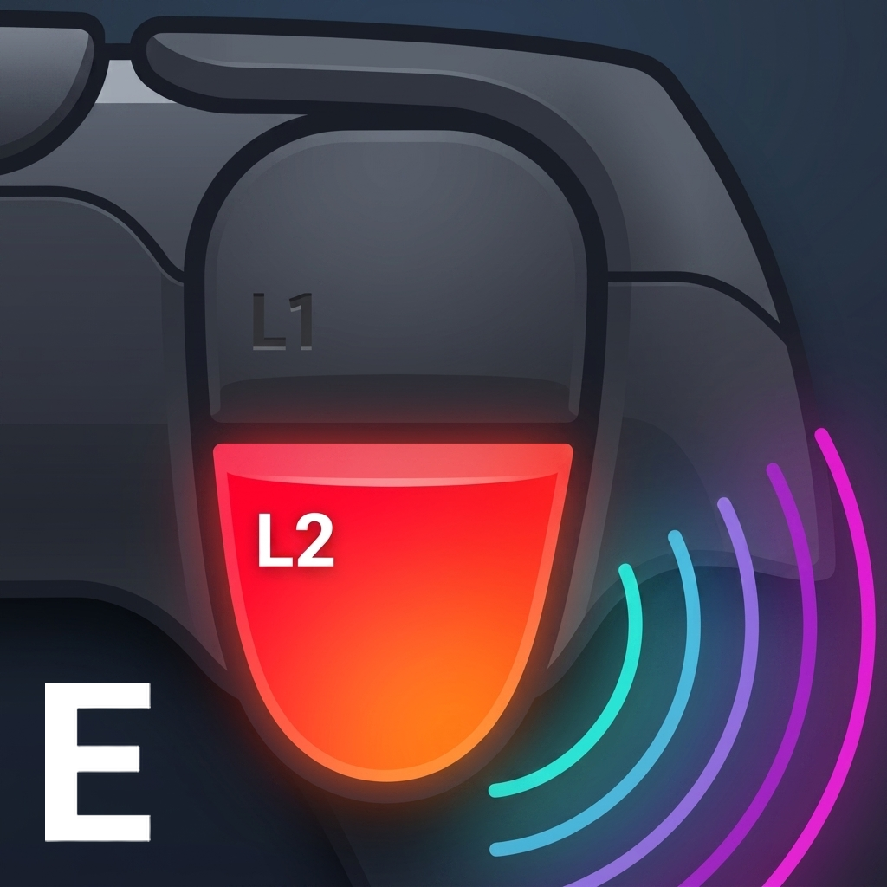

  <strong>English</strong> •
  <a href="docs/ReadmeZH.md">简体中文</a> •
  <a href="docs/ReadmeJA.md">日本語</a>

  
  <h1>FH-DualSense-Enhanced</h1>
  
<strong>Adaptive triggers and telemetry-driven DualSense haptics for Forza Horizon on PC.</strong>

> Supports Windows Steam and Xbox App workflows for Forza Horizon 4, Forza Horizon 5, and Forza Horizon 6.

FH-DualSense-Enhanced turns Forza Horizon Data Out telemetry into DualSense feedback.

This is an unofficial enhanced fork based on `Forza-Horizon-DualSense-Python 1.6.2`, with haptics work informed by `HorizonHaptics 1.3.0`.

## What Enhanced adds over upstream 1.6.2

- Telemetry-driven grip haptics combine engine, road, suspension, water, tire slip, ABS, directional impacts, and dynamic redline learning shared with the tachometer lightbar.
- Expanded adaptive-trigger behavior adds dynamic traction and wheelspin, surface-aware frequency bands, zoned ABS, and optional telemetry layers.
- USB and Bluetooth use the same stereo haptic mix; Bluetooth adds HD transport and falls back only when that transport actually fails.
- R11's community-tuned `Default` enables ABS; earlier tuning remains as `Default before R11`. Profiles, factory restore, Haptics Lab previews, and local diagnostics are available.
- The multilingual interface supports FH4/FH5/FH6 launching, Xbox App XInput, optional motion-to-stick mapping, and reversible FH6 DualSense icons. Motion mapping is off by default and requires custom mapping and gyro switches.
- The EXE verifies updates, preserves settings and matching shortcuts, and recovers interrupted replacements.

## Download

### Windows, recommended

1. Open the [latest release](https://github.com/piereacy/FH-DualSense-Enhanced/releases/latest).
2. Download `FH-DualSense-Enhanced-R<n>.exe`.
3. Run the EXE. Python, BAT, ZUV, and uv are not required.

Other launch options:

- Windows bootstrap: download `win_start.bat`. If your connection is unreliable, place `FH-DualSense-Enhanced.zuv.py` beside it before running.
- Linux: download `linux_start.sh`. If controller permissions fail, install the provided [`70-dualsense.rules`](packaging/linux/70-dualsense.rules) manually.

## Required game setup

### 1. Choose the game platform

- **Steam:** Keep Steam Input enabled in **Game Properties -> Controller**, including DualSense vibration support.
- **Xbox App:** Select Xbox App. FHDS uses its XInput bridge instead of DS4Windows or Steam Input. First use may require offline ViGEmBus installation through UAC.
  HidHide is required. **Overview -> Quick access** installs it on demand with verified download, UAC, and progress. Once virtual Xbox input is ready, FHDS enables hiding automatically if existing rules only target DualSense. The official client can be opened there. Xbox input stays neutral and game launch is disabled until the physical controller is hidden. Reconnect or restart if prompted. FHDS removes its own rules on exit.

### 2. Enable Forza Data Out

In Forza Horizon, open **Settings -> HUD and Gameplay** and set:

| Setting | Value |
| --- | --- |
| Data Out | ON |
| Data Out IP Address | `127.0.0.1` |
| Data Out IP Port | `5300` |

If loopback packets are not received, try `::1` in both the game and the app.

### 3. Start in this order

1. Connect the DualSense controller.
2. Start FH-DualSense-Enhanced and confirm that the controller and UDP listener are ready.
3. Start the game.

> [!IMPORTANT]
> In Steam mode, keep Steam Input enabled. In every mode, turn **Vibration** off in Forza's own settings. Native game rumble competes with and masks the controller's grip haptics, so grip feedback will not work correctly when both are active.
>
> FHDS keeps its native controller backend active until exit. Close it before another game or tool needs the DualSense.

## USB and Bluetooth

Both connections use the same telemetry decisions and support adaptive triggers, road detail, engine feedback, redline effects, and directional impacts.

| Connection | Notes |
| --- | --- |
| USB | Body haptics use the DualSense audio endpoint; adaptive triggers use HID. |
| Bluetooth | Haptics and triggers are sent through HID. If HD haptics are unavailable, the app falls back automatically while keeping trigger support. |

## Troubleshooting

| Symptom | What to check |
| --- | --- |
| `No UDP packets yet` | Verify Data Out, the listen address, UDP port `5300`, and the Windows Firewall rule. |
| `WinError 10048` | Another app instance already owns UDP port `5300`; close the duplicate listener. |
| DualSense not found | Reconnect the controller and check Steam, HidHide, or another app that may have claimed it. |
| USB haptics or `PaErrorCode -9999` | Check the DualSense audio device, close apps using it, and reconnect USB. Trigger feedback remains available. |
| Bluetooth haptics fallback | Reconnect the controller to retry HD haptics. Trigger feedback remains available during fallback. |
| Xbox App input missing | Select Xbox App in the app, finish the ViGEmBus setup if prompted, and do not run Steam Input or DS4Windows for the same controller. |

## FH6 utilities

The dedicated **FH6 utilities** page provides Chinese-text plus English-voice file swapping and a reversible DualSense icon MOD for Steam or Xbox App installations. Steam and Xbox App install folders are detected automatically, with manual selection retained as a fallback. Language status separately shows game, display, and voice language without inventing values that cannot be verified. Game updates may restore files, so reapply a utility when needed. Thanks to icon MOD author [@hotline1337](https://github.com/hotline1337): [Nexus Mods MOD page](https://www.nexusmods.com/forzahorizon6/mods/2).

## Credits and license

Originally created by Hamza Yeşilmen (HamzaYslmn):
[Forza-Horizon-DualSense-Python](https://github.com/HamzaYslmn/Forza-Horizon-DualSense-Python)

The body-haptics work references [HorizonHaptics](https://github.com/haritha99ch/HorizonHaptics), and the Bluetooth protocol work references [vDS](https://github.com/hurryman2212/vds). Their notices remain credited in this repository.

This project uses a custom source-available license for personal, non-commercial use. Read [LICENSE](LICENSE) before copying, modifying, or redistributing it.
