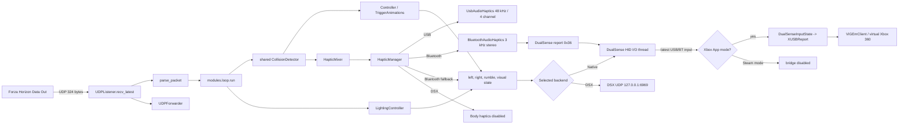

# FH-DualSense-Enhanced 架构说明

## 1. 项目定位

FH-DualSense-Enhanced 是一个运行在 PC 上的本地 Python 应用。它监听 Forza Horizon Data Out 的 UDP 遥测，根据车辆的刹车、油门、转速、轮胎、路面、悬挂和碰撞状态生成两类输出：

- L2/R2 自适应扳机效果。
- DualSense 握把触觉。USB 使用手柄四声道音频端点，Bluetooth 把同一左右 PCM 波形编码为 HID audio-haptics report `0x36`；失败时才使用 compatible rumble。
- 可选的转速灯带、红线闪烁和挡位 Player LEDs。
- Windows x64 的 Xbox App 模式可把物理 DualSense 输入映射成 ViGEm 虚拟 Xbox 360 Controller；Steam 模式不创建虚拟设备。
- Windows 界面可显式安装或还原内置的 FH6 DualSense 按键图标 MOD，原始普通与 HiRes 文件分别备份。
- 冻结后的 Windows 独立 EXE 内置 GitHub Release 检查、校验下载和重启替换；源码、Linux 与 ZUV 运行不自替换。

主要使用场景是玩家在 Windows 或 Linux 上运行 Forza Horizon，同时通过 USB 或 Bluetooth 连接 DualSense。程序也可把自适应扳机发送给本机 DSX，但 DSX 路径不提供本项目的握把触觉。英文用户说明见根 `README.md`，简体中文和日语分别见 `docs/ReadmeZH.md`、`docs/ReadmeJA.md`；实现入口见 `src/main.py`。

项目不是游戏插件，不注入游戏进程，也没有数据库或远程业务服务。游戏只通过 UDP 单向发送遥测，程序只在本机控制手柄或向配置的 UDP 目标转发原始包。

用户文档以 `Forza-Horizon-DualSense-Python 1.6.2` 作为能力比较基线。三语 README 描述当前 Enhanced 版本相对该基线的累计核心增强；单个 GitHub Release body 描述该版本相对上一稳定 Enhanced 版本的增量。前者回答“本项目比上游多什么”，后者回答“这次更新比上一版多什么”，两者不得共用“本版新增”等含混措辞。README 的累计清单只总结用户可感知能力，具体实现和传输约束仍以本架构文档与代码为准。GitHub 仓库已经脱离 fork network，但 Git 历史、许可证署名、原项目链接和第三方归属继续保留。

README 同时存在本地开发输入和用户在 GitHub 直接提交的远端输入。发布或同步链路必须先获取远端提交，再以逐段语义合并维持两者；远端 README 改动属于需要保留和理解的用户内容，不是可由本地工作树整体覆盖的生成物。发生冲突时应结合远端改动意图与本次本地更新重新组织文本，不能默认以本地版本为准。

## 2. 整体结构



`src/modules/loop.py` 是系统的运行时中枢。它不直接了解 USB 音频细节或 HID 字节布局，而是组合 Forza 效果计算、握把混音和后端输出。

## 3. 程序入口和运行模式

### 3.1 `src/main.py`

启动顺序如下：

1. `main()` 首先调用 `modules.dpi.bootstrap_windows_dpi()`；冻结 Windows 构建还会在 Python 入口前执行 `packaging/windows/dpi_runtime_hook.py`，确保 Tk 创建窗口前已确定 DPI awareness。运行配置只读取进程环境，不隐式加载当前目录的 dotenv 文件。
2. 解析公开 CLI 与更新器内部 transaction/token 参数，先检测 R6 legacy bootstrap，再按 journal 恢复未完成更新事务。
3. 创建 `Settings`，再由 `preferences.load()` 应用 global settings 和当前 Profile。偏好文件损坏时，GUI 模式显示真实 Tk 恢复弹窗；TUI/headless 才使用终端确认。
4. 处理 `--host`、`--port`、`--debug`、`--headless`、`--gui` 和 `--tui`。
5. 默认启动 `CustomTkinter` GUI。`--tui` 启动 Textual，`--headless` 在当前线程运行后端。更新健康 ACK 只在所选模式达到最低可用边界后写入：headless 完成 controller、可选 XInput 与 UDP listener 初始化；GUI/TUI 由构造函数保存的一次性 callback 在 backend、listener 和 telemetry worker 已启动后提交。该 callback 失败会终止新版本，使 Helper 进入回滚，而不是把“窗口构造成功”误当成可用。

未捕获异常由 `_excepthook` 写入 `data/crash.log`。`src/modules/runtime_logging.py` 还为 GUI、TUI 和 headless 安装同一个轮转 `data/runtime.log`，单文件上限 2 MiB、保留两个备份，用来保存退出界面后仍需分析的 HID、CRC、ViGEm 和 handover 事件。冻结 EXE 的可写 `data` 位于 EXE 旁边；源码和 ZUV 模式使用 `src/data` 或解包根目录下的 `data`。路径规则集中在 `src/modules/config/paths.py`。

### 3.2 GUI 和 TUI

`src/modules/gui/main.py` 和 `src/modules/tui/main.py` 都负责：

- 加载语言和配置。
- 创建 native HID 或 DSX 后端。
- 打开 UDP listener。
- 在 worker thread 中运行 `modules.loop.run()`。
- 管理共享 `UsbAudioHaptics` 生命周期。
- 在 Windows x64 上按 `preferred_forza_platform` 管理可选 `XInputBridgeService`；物理输入仍由 native HID I/O thread 唯一读取。
- 在退出时依次停止 loop、音频、listener 和手柄。

GUI 的 Tk widget 只由主线程访问。后台日志进入最多 4000 条的 queue，再由 Tk 定时读取。最小化到托盘由 `settings.minimize_to_tray` 控制；窗口关闭、托盘退出、游戏关闭、遥测超时和更新重启都进入 `TriggerGUI.request_close()`，再由同一 teardown 顺序退出。TUI 的快捷键、退出按钮、backend shutdown 和更新重启同样进入 `TriggerTUI.request_close()`。两套入口都先处理 `Default` Profile 的可选命名保存，更新安装 callback 只在确认退出后执行。托盘实现位于 `src/modules/gui/tray.py`。

Enhanced R4 只保留一个左侧导航壳层。其青绿色视觉来源在项目内部称为 Miku Console 设计理念，但当前产品名称、窗口标题和构建资产只使用 `FH-DualSense-Enhanced`。颜色与间距令牌集中在 `src/modules/gui/theme.py`，主强调色为 `#39C5BB`。`TriggerGUI._build_body()` 创建全部页面后，把每个 tab frame 只 `grid()` 到同一内容单元格一次；`_select_nav()` 通过 `tkraise()` 和可选 `on_show()`/`on_hide()` 改变当前页，不再以 `pack_forget()`/`pack()` 触发整页重复布局。长页面使用 `widgets.FastScroll` 注册到根窗口 `WheelRouter`：根窗口命中测试只返回当前 raised 页的指针祖先，内层到达目标方向边界后才转交外层。只有 raised 页的 `FastScroll` 响应 canvas 尺寸变化，40 ms debounce 合并最大化/拖拽产生的连续事件；隐藏页只记住最新尺寸，重新显示时同步一次，从而保留常驻页面状态又避免所有长页同时回流。驾驶反馈页的卡片保持自然高度，内容宽度低于阈值时只重新排列为单列，不重建开关。顶部 Profile 和控制器状态沿用 `W.Pill` 接口，但渲染为 28 logical px 高、8 logical px 圆角的小型状态框；间距与状态点尺寸使用 4 的倍数，重复 presentation 值不再次调用 `configure()`。Enhanced R7 由嵌入 manifest 与早期 runtime bootstrap 共同目标化 Per-Monitor v2；`modules.dpi.query_dpi_state()` 查询实际 thread/window awareness 和缩放，系统页与日志展示结果。CustomTkinter 继续负责自身 widget scaling，项目不额外叠加用户缩放系数。

GUI 的 `src/modules/gui/about_tab.py` 和 TUI 的 `src/modules/tui/about_tab.py` 是独立的“关于与许可证”页面，均位于日志之后，复用 `src/modules/about.py` 的署名、原项目、Sponsor URL、ViGEm 第三方链接和 `@hotline1337` 的 Nexus MOD 链接。`settings_tab.py` 只负责握把触觉与调校，不再承载许可证卡片；总览页也不展示 Sponsor 或无功能的版本工作台。

产品图标以 `src/data/icon.png` 和 `src/data/icon.ico` 为单一资产对。Tk 标题栏先用 1024 px PNG 提供高 DPI 源，再用 ICO 兼容 Windows；`TrayController` 读取同一 PNG。Windows 主 EXE 与更新 Helper 由 PyInstaller 嵌入同一七尺寸 ICO，Windows/Linux bundle 都携带 PNG 与 ICO，不维护按界面或平台分叉的图标副本。

GUI 总览由 `src/modules/gui/overview_status.py` 负责纯状态映射，`OverviewTab` 只更新控件。Native 控制器事实来自 `DualSense.snapshot()` 返回的不可变 `ControllerSnapshot`，DSX 使用自身受限状态；Profile 来自配置存储；更新状态来自 `UpdateService` 的不可变快照；遥测状态来自 `UDPListener.snapshot()`；Xbox App 输入状态来自 `XInputBridgeService.snapshot()`。顶部控制器 Pill 只消费 controller snapshot，不再被 UDP bind 错误覆盖。页面构造完成后立即渲染一次，之后由 GUI 每秒状态 tick 刷新，设置或语言切换仍可通过已有 refresh callback 立即触发。短状态和详细提示分开，异常原因不占用 H1 主文案。

总览快捷入口包含 Steam/Xbox App 平台选择和 FH4/FH5/FH6 分体启动按钮。`src/modules/forzahorizon/game_launch.py` 用不可变注册表保存三代游戏的稳定键、Steam App ID、Xbox product ID 和精确 EXE 名。`OverviewTab` 左侧按钮只启动当前选择，右侧菜单只改变选择；首次默认 FH6 与 Steam，之后由 global 设置 `preferred_forza_game`、`preferred_forza_platform` 恢复最后选择。Steam 每代安装路径分别缓存到 `fh4_install_path`、`fh5_install_path`、`fh6_install_path`，不进入车辆 Profile 或分享码。

扫描和启动请求运行在 worker thread，结果携带游戏键、平台与递增序号，由 Tk 主线程消费。用户切换游戏、平台或 path hint 后，旧选择或旧序号的结果不得覆盖当前按钮。Steam 安装发现只处理当前选择：尚无首轮结果时立即扫描，未找到后每 30 秒静默重试，找到有效根目录后停止；只有缓存路径变化或显式启动重新验证失败才重新进入发现。静默重试不把“未找到”改回“正在查找”。Xbox App 模式不执行 Steam 安装发现，AUMID 枚举只在用户点击启动时运行。快捷入口把平台、游戏、按钮文字/可用性、selector 状态和 XInput action 组成稳定 presentation tuple，只有 tuple 改变才调用控件 `configure()`、`grid()` 或 `grid_forget()`，精确进程检测本身仍可每秒运行。Steam 通过三代固定 `steam://run/<app-id>` 启动；Xbox App 通过 `shell:AppsFolder\\<AUMID>` 激活或打开固定产品页。两条路径都不直启 EXE、不自动启动、不静默提权；启动等待上限二十秒，通用模块不读取、交换或修复 FH6 语言 ZIP。

### 3.3 Windows 独立 EXE 更新器

`src/modules/update/` 与触觉后端相互独立。`GitHubReleaseClient` 从 `piereacy/FH-DualSense-Enhanced` 的 Releases API 中筛选非 draft、非 prerelease 且 tag 严格匹配 `R<n>` 的版本，只接受规范资产 `FH-DualSense-Enhanced-R<n>.exe` 和配套 `.sha256`。API、校验文件和 EXE 都有限制大小与网络超时；下载先写 `.part`，完成后检查实际长度、SHA-256 和 `MZ` 头。

发布侧由 `packaging/windows/build_exe.bat` 构建规范 EXE，再调用 `packaging/windows/write_sha256.py` 流式计算 SHA-256，并以固定 ASCII sidecar 格式写入。`.github/workflows/release.yml` 在上传 artifact 前再次以同一脚本 `--check` 复算并严格比较；缺失、不匹配或生成命令失败都会使 Windows job 失败。该边界避免依赖 runner 是否提供 `Get-FileHash` 或本地化的系统哈希输出。下载侧只从 sidecar 中接受完整 64 位十六进制哈希，因此构建侧和运行侧形成同一发布契约。

`UpdateService` 在后台线程维护 `IDLE -> CHECKING -> AVAILABLE|UP_TO_DATE|ERROR -> DOWNLOADING -> VERIFYING -> READY -> INSTALLING` 快照，GUI/TUI 只轮询不可变状态。自动检查默认开启并在启动约 10 秒后执行一次；后台下载默认关闭，安装始终需要用户点击“重启并安装”。当前实现没有跨启动的 24 小时检查节流，也不在应用内展开 Release body，只提供打开 Release 链接。

GUI 根据同一快照决定“系统与更新”导航白点。只有快照持有新 Release 且处于可用、下载、校验、待安装或错误状态时显示；进入页面不会清除。`widgets.NavButton` 直接在按钮内部 canvas 绘制 5 px 白色圆点，不创建 Label 或位图，因此选中、未选中和 hover 时都不存在独立矩形背景。更新安装的 Helper 调度被延迟到统一退出提示完成之后，调度失败时主程序保持运行。

Windows 不能覆盖正在运行的主程序。`src/modules/update/transaction.py` 因此为每次安装在 `data/updates/transactions/<id>/transaction.json` 原子保存旧/新绝对路径、版本、两端 SHA-256、PID、公开重启参数、随机 token、阶段和快捷方式进度。阶段从 `prepared`、`waiting_old_exit`、`new_installed`、`waiting_health`、`shortcuts_migrating`、`cleanup_pending` 进入 `committed` 或 `rolled_back`；`src/modules/update/install.py` 在启动前按 journal 和哈希恢复，不凭文件名或 `.old` 存在性盲删文件。入口仍由 `self_update_supported()` 限制为 `sys.frozen` 的 Windows 进程，源码、Linux 和 ZUV 界面的更新按钮被禁用。

R7 以后的正常更新采用版本化并排安装：保留正在使用的 `R<n>.exe`，把已验证资产安装为规范 `R<n+1>.exe`，启动新版，在 30 秒内等待 token、版本、路径和哈希一致的原子健康 ACK，再观察进程约 3 秒。PyInstaller one-file 的外层 bootloader PID 与写 ACK 的内层应用 PID 可以不同，因此 token 是身份凭据，Helper 只要求外层启动进程继续存活。健康失败删除未提交新版并重启旧版；健康成功后才进入目录收口。Helper 枚举新版所在目录中名称严格匹配 `FH-DualSense-Enhanced-R<n>.exe` 且版本低于新版的规范 EXE，逐个迁移其快捷方式；迁移成功后静默删除这些旧 EXE，以及严格同名的 `.exe.old` 和 `.exe.sha256`。它不执行宽泛的 `*.exe` 或 `*.old` 清理，不碰同级其他程序，也不删除同版或更高版本。正常路径不创建 `.old`。

已经发布的 R6 旧 Helper 无法并排安装，会把 R7 字节写入 `R6.exe` 并留下真实 R6 的 `R6.exe.old`。`launch_legacy_bootstrap()` 只有在文件名版本、内置版本、两份 PE 版本资源和 `.old` 形态全部匹配时才进入第二阶段：恢复规范 R6，安装规范 R7，再走相同健康确认。提交时的目录收口也会删除更早更新遗留的严格命名文件，例如 `FH-DualSense-Enhanced-R5.exe.old`。`packaging/windows/shortcut_links.py` 使用原生 Shell Link COM 精确迁移 Desktop、Programs 和已知 pinned 目录中目标绝对路径匹配旧 EXE 的 `.lnk`，保留参数、工作目录和图标索引；无匹配静默成功，某一旧版存在失败项时只保留该规范旧 EXE 并让 journal 停在 `cleanup_pending`，其他已成功迁移的旧版和遗留 sidecar 仍可清理。Helper 与构建均使用 `src/uv.lock` 中固定的 PyInstaller，不在构建时解析任意最新版本。

### 3.4 Windows FH6 语言包按钮

`src/modules/forzahorizon/fh6_language.py` 是独立于遥测与手柄后端的 Windows FH6 工具层。Steam 模式复用 `game_launch.py` 的安装候选发现与精确进程检测；Xbox App 模式不尝试扫描受保护 package，而是只验证用户选择并保存到 `fh6_xbox_install_path` 的目录。用户可以选择直接包含 payload 的根目录，或选择直接父目录后由验证器尝试唯一固定的 `Content` 子目录；这不是系统盘或 `XboxGames` 递归发现。最终根目录必须同时存在 `ForzaHorizon6.exe` 与 `media/Stripped/StringTables`，生产代码不假定盘符或 `Program Files`。GUI 中显式选择会用新 serial 取代仍在运行的自动扫描，旧 worker 的结果因 serial 不匹配而丢弃；无效选择会产生可见提示。语言工具仍只接受 FH6，通用启动模块不能导入语言交换逻辑。

语言状态不是内存布尔值，而是每次从 `CHS.zip`、`EN.zip` 和 `CHS.zip.fhds-swap.tmp` 的实际存在性与 ZIP 内多个 `.str` UTF-8 样本判定。可识别状态为原始、已交换、可恢复的中断状态、缺失、未知和损坏。只有一份可识别中文包和一份可识别英文包时才允许动作；Steam manifest 明确不是 English 时禁止启用，Steam 手动路径或 Xbox App 无法读取游戏语言时必须额外确认。普通状态轮询、启动扫描和手动选目录全部只读。

`FH6Install.steam_language` 是 Steam manifest 中 FH6 的游戏内容语言 token，不表示 Steam 客户端的显示语言；Xbox App 安装没有这个 token。纯函数 `summarize_fh6_languages()` 把一次 `LanguageInspection` 转换为不可变 `FH6LanguageSummary`：规范化的游戏语言 token、当前实际文字语言和语音语言 token。English 原始状态映射为 `english / ENGLISH / english`，交换状态映射为 `english / CHINESE / english`；缺失、损坏、恢复中、Xbox App 未知语言或未支持的组合不猜测实际文字语言。`language_summary_view()` 只负责本地化同一摘要。GUI/TUI 在独立 `FH6 utilities` 页面常驻显示“当前 FH6 游戏使用语言”“实际显示语言”“语音语言”三行；Steam 交换状态显示英语 / 中文 / 英语，Xbox App 无法验证的语言明确显示未知。

启用与还原共用三步 rename：`CHS.zip -> temp`、`EN.zip -> CHS.zip`、`temp -> EN.zip`。每一步前重新验证路径、源/目标存在性和 FH6 未运行，异常时按已完成步骤逆序回滚。进程崩溃留下 temp 时，下次启动只报告恢复需求；`repair_native_language()` 只有在用户再次确认且两份内容可识别时才把中文放回 CHS、英文放回 EN，不自动删除任何文件。GUI 使用确认弹窗并在 worker thread 执行，TUI 使用十秒内二次按键确认；两者共享 `fh6_language_presentation.py` 的状态、动作和三行摘要映射。Steam 缓存字段 `fh6_install_path` 由 FH6 启动、语言和图标工具复用；Xbox App 语言与图标工具共用 `fh6_xbox_install_path`。两者都属于 `preferences.GLOBAL_FIELDS`，不进入 Profile 或 share code。

### 3.5 Windows Xbox App XInput bridge

`src/modules/dualsense/input_state.py` 只解析已验证长度、report ID 和 Bluetooth `0xA1` CRC 的 USB/BT 输入报告，生成不可变 `DualSenseInputState`。`src/modules/dualsense/main.py` 的 I/O thread 始终读取和解析完整输入，以维持连接真值、电量与 watchdog；设置 input consumer 后，它会优先 drain 当前 HID 队列，只把这一批中最新的有效状态连同单调时钟时间非阻塞发布给 bridge，不执行 ViGEm 调用。达到单批安全上限时先继续追赶输入，再处理单槽合并后的输出。这样 Bluetooth HD haptics 持续产生 `0x36` 时不会把读取限制为每轮一条，也不会把 Windows 队列中的旧输入逐条重新标记为“刚收到”。Steam 模式或 DSX backend 不挂 consumer，继续使用输出优先的普通 drain，但 native 输入解析不会因此停止。

`src/modules/xinput/report.py` 把标准按钮、D-pad、摇杆和 L2/R2 扳机键映射为 `XUSB_REPORT`，不增加 deadzone、平滑或 response curve。`bridge.py` 的单 worker 独占 `ViGEmClient` 和虚拟 Xbox 360 target，只保留 latest state：100 ms 未收到有效报告时发送一次全中立，但只要 Xbox bridge 模式仍启用就保留同一个 target 和 player slot，避免 Forza 运行中重新枚举虚拟手柄。新输入恢复时直接复用该 target，不回放 stop 前状态。ViGEm session 的非 driver-missing 异常会清理旧 target/client，并按 0.25、1、5 秒上限自动重建；driver 缺失仍保持稳定状态等待用户安装或重试。`service.py` 负责 `preferred_forza_platform` 的生命周期切换，Steam 模式先解除 consumer、停止 worker并移除 target。Bluetooth 同一 I/O 轮次若已有 `0x36`，该 report 的 state block 已携带最新 L2/R2 扳机键和灯效；普通 state frame 没有 compatible rumble 时会被合并，避免为相同状态再占用一次 HID write。显式 rumble 及其全零释放仍走普通 report，不能被合并掉。

`vigem_client.py` 使用项目自有 `ctypes` 最小 ABI 加载固定哈希的 x64 `ViGEmClient.dll`，没有导入 `vgamepad` runtime。`driver.py` 先按真实 client connect 探测兼容 bus；只有缺失时、用户明确确认后，才校验内置 ViGEmBus `1.22.0` 安装器的 SHA-256 与 cache-only Authenticode，再以 `runas` 触发 UAC。已有兼容 driver 不升级，安装器不联网下载资源。当前不注册 rumble callback、不模拟 Xbox One、不安装或配置 HidHide。ViGEmBus 与 ViGEmClient 已停止上游维护，版本和哈希见 `docs/THIRD_PARTY_NOTICES.md`。

### 3.6 FH6 DualSense 按键图标工具

`src/modules/forzahorizon/controller_icons.py` 是独立于遥测、触觉与启动器的显式文件事务。Windows bundle 只携带一份固定 SHA-256 的 `ControllerIcons.zip`，安装时把它分别写入 `media/UI/Textures/Data_Bound` 与 `media/UI/Textures/HiRes/Data_Bound`。两个原文件在首次修改前分别复制到应用数据目录，manifest 绑定已解析的游戏根路径和原始哈希；写入使用同目录临时文件与 replace，失败时回滚。检测到游戏更新后的新原件时先刷新备份，检测到部分安装但无完整有效备份时拒绝继续。

工具只在用户点击并确认后安装、还原或修复；FH6 运行中拒绝写入。Steam 路径复用通用发现，Xbox App 路径当前由用户手动选择并保存为 `fh6_xbox_install_path`；与语言工具相同，外层游戏目录和直接 `Content` payload 都可作为选择入口。GUI/TUI 通过各自的 `fh6_utilities_tab.py` 把语言与图标工具组合成独立页面，`SystemTab` 不持有两者的字段、timer 或 worker。该页首次显示、path hint/平台变化和显式操作后扫描；未找到时只在可见期间每 30 秒静默重试，找到后停止文件发现，已知路径期间只保留轻量进程状态刷新。工具页和关于页均链接 Nexus 来源并鸣谢 `@hotline1337`；该归属同时保存在三语 README、Release body 和 `docs/THIRD_PARTY_NOTICES.md`。Linux bundle 不携带 MOD。

## 4. 遥测输入层

### 4.1 UDP 监听

`src/modules/forzahorizon/udp_listener.py` 首先尝试绑定一个 `[::]:port` 的 dual-stack IPv6 socket，失败后回退到 `settings.udp_host:settings.udp_port` 的 IPv4 socket。默认端口为 `5300`，接收超时为 `0.5s`。

`recv_latest()` 先阻塞等待一个包，然后把 socket 临时设为 non-blocking 并排空队列，只返回队列中最新的 324 字节有效包。错误长度数据包只做一次警告，不推进运行时计数；即使队尾是无关 UDP 数据，前面较新的有效 Forza 包仍可返回。这样做是为了降低控制反馈延迟，避免对积压的旧遥测逐帧反应。接收缓冲区设为 4096 字节。

每个有效数据包还会在短锁内更新计数、单调时钟时间和来源地址。`TelemetrySnapshot` 在无有效包时为 `WAITING`，最后有效包不超过一秒时为 `RECEIVING`，超过一秒时为 `LOST`。这个快照只供状态界面读取，不替代 `modules.loop` 现有的一秒静音、五秒告警和可配置遥测丢失退出语义。

启用 `udp_forward` 时，`UDPForwarder` 在同一热循环中把收到的每一个原始包转发到 `udp_forward_to` 中的 `host:port` 列表。转发失败只警告一次，不中断主循环。

### 4.2 324 字节数据模型

`parse_packet()` 使用固定 offset 把包解析为普通 `dict`，没有独立的 typed model。主要字段包括：

- 会话和车辆：`on`、`timestamp_ms`、`car_ordinal`、`drive_train`、`gear`。
- 动力：`rpm`、`idle_rpm`、`max_rpm`、`power`、`torque`、`boost`。
- 运动：`speed`、`accel_x/y/z`、速度、角速度和姿态。
- 四轮状态：轮速、slip ratio、slip angle、combined slip、surface rumble、puddle、rumble strip、悬挂行程。
- 输入：`accel`、`brake`、`clutch`、`handbrake` 和 `steer`。

速度在解析时从 m/s 转为 km/h。当前代码按 `PACKET_SIZE = 324` 判断预期包长，offset 依据 Forza Data Out 格式和 FH6 新增字段固定。修改 offset 会同时影响扳机、握把和测试，不能当作普通重构处理。

## 5. 自适应扳机子系统

### 5.1 游戏无关 primitive

`src/modules/dualsense/adaptive_trigger.py` 把一个扳机效果表示为：

```text
(mode_byte, params_tuple)
```

该层提供 `off`、`rigid`、`vibrate`、`rigid_zones`、`vibrate_zones` 以及 firmware 的 bow、gallop、machine、weapon 等 primitive，不包含 Forza 判断。

### 5.2 Forza 效果和优先级

`src/modules/forzahorizon/effects.py` 的 `TriggerAnimations` 保存换挡、通用抓地力 EWMA/hysteresis 和 ABS hold deadline 等跨帧状态。`Controller` 每个遥测 tick 只计算一次抓地力 effect，再按踏板状态路由到 L2 或 R2 frame；两侧仍采用 first-match priority，较高优先级会遮蔽后续效果。遥测 `on=False` 时会复位这些 transient state 和两侧 wall latch，防止恢复后沿用旧效果。

`src/modules/forzahorizon/redline.py` 在 `src/modules/loop.py` 的同一遥测帧中先生成共享的 `effective_redline_rpm`、`rev_limiter_active` 和置信度。Forza Data Out 没有显式断油标志，因此未学习时根据仪表 `max_rpm` 使用受限经验曲线，并保证估计值不低于已经稳定观察到的发动机转速；高油门、稳定同挡、接近预测红线且无离合或严重打滑时，检测相对功率/扭矩骤降或非正功率。候选事件需要继续保持同一挡位 120 ms 才确认，连续三个接近的候选以中位数建立学习值，之后允许缓慢修正。车辆 ordinal、PI 或仪表转速范围变化会重置学习；菜单中暂时归零的车辆身份不会清除已有结果。

估计器不修改 UDP parser 返回的原始 `max_rpm`。R2 扳机键红线、握把红线和 `LightingController` 转速灯条读取 `effective_redline_rpm`，已经确认的断油事件还能短暂强制红线反馈与灯条闪烁；动态估计不可用时灯条回退到原始 `max_rpm`。发动机连续底噪和其他未明确迁移的 RPM 归一化仍读取原始范围，避免覆盖共享 telemetry 后连带改变无关效果。学习状态只存在于当前进程和当前车辆，不写入 Profile，也不跨启动持久化。

当前 L2 顺序：

1. 可选碰撞扳机冲击。
2. 换挡冲击。
3. GT7 风格 ABS zoned wall：顶部 zone 保持满强度 wall，下部 zone 动态振动。
4. 仅踩刹车时的通用纵向抓地力反馈。
5. 接近行程末端的 firmware wall。
6. 可选静态刹车 wall。
7. 刹车阻力曲线。
8. L2 未踩下且以上均无输出时的可选路面/减速带纹理。

当前 R2 扳机键顺序：

1. 可选碰撞扳机冲击。
2. 换挡冲击。
3. 原地轻踩油门 idle buzz。
4. 踩油门或同时踩下两块踏板时的通用纵向抓地力反馈。
5. 踩住油门时的红线震动。
6. 接近行程末端的 firmware wall。
7. 涡轮增压、G 力与普通油门阻力的合成 ramp；新增两层均默认关闭。
8. R2 扳机键未踩下且以上均无输出时的可选路面/减速带纹理。

第 7 层由 `TriggerAnimations.throttle_ramp()` 加法合成，而不是在基础油门阻力与实验层之间二选一。基础项在 `enable_throttle_resistance=True` 时使用 `_ramp(accel, accel_deadzone, throttle_baseline_force, throttle_max_force, throttle_curve, throttle_wall_engage_at)`；Enhanced R3 与 Enhanced R4 的默认值均为 `baseline=0`、`max_force=1`、`curve=5.0`。可选 boost 项和 G 力项只在各自开关开启时增加 force，最终统一交给 `rigid()`。

G 力项按 `sqrt(gforce_lateral_weight * accel_x^2 + gforce_longitudinal_weight * accel_z^2) / 9.80665` 计算无符号幅值，经 `gforce_full_scale` 归一化和按真实 `dt` 工作的非对称 EWMA 后，增加 `gforce_resistance_force * level`。默认权重为横向 `0.25`、纵向 `1.0`，满量程 `1.5G`，attack `70 ms`、release `180 ms`、最大附加 force `28`。它不拦截或延迟游戏输入，但平滑会让触觉本身延后建立和释放。当前实现没有油门门控，也不保留加速度正负号，因此刹车、过弯、碰撞或换挡瞬态都可能使 R2 扳机键变硬；这是该功能保持实验性且默认关闭的重要原因。

R3/R4 代码审计显示 `src/modules/dualsense/adaptive_trigger.py` 未变，基础 ramp 参数和抓地力路径也未被 G 力实现删除。实验层关闭且 R2 扳机键已经按下时，普通 ramp 应保持 Enhanced R3 输出；已确认的细小差异仅是油门值恰为 `0` 时，Enhanced R3 发送 `rigid(0)`，Enhanced R4 因 `force > 0` guard 发送 `off()`。这一差异不足以解释目前用户报告的整体手感变化，仍需同条件实机 A/B 和最终 frame 追踪。

通用抓地力的踏板来源是 Forza Data Out 的 `brake`/`accel`，不是 DualSense input report。只踩刹车时路由到 L2，只踩油门时路由到 R2，同时踩下时只路由到 R2；ABS 是独立的 L2 高优先级 effect，因此双踏板状态可同时输出 L2 ABS 和 R2 抓地力。高于 `LOW_SPEED_KMH` 时，油门单独使用 driven wheel longitudinal `tire_slip_ratio_*`，刹车参与时使用四轮最大绝对纵向滑移。低速只有油门参与时才用 driven wheel raw rotation 识别烧胎，低速纯刹车不会用 rotation 猜测抓地力。

抓地力继续复用 R2 已验证的一套 threshold、hysteresis 和按真实 `dt` 计算的非对称 EWMA，默认约 40 ms attack、125 ms release。主导车轮的 puddle 与 `surface_rumble` 选择 tarmac、water、dirt、gravel 频带，G force 只对 amplitude 作最多约 30% 的反向 damping。为兼容既有 Profile，设置字段仍使用 `wheelspin_*` 内部名称；UI 和文档使用 traction/grip 术语。

ABS 以四轮 longitudinal slip ratio 为主、combined slip 为低权重辅助。`abs_min_speed_kmh` 只负责低速 gating，pulse frequency 和 strength 由 normalized slip 决定，并用 `abs_hold_ms` 保留短暂 deadline。native USB/BT 输出 `vibrate_zones()`，默认顶部 3 个 zone 为满强度 wall；DSX 无法保留该 wall，`src/modules/dsx/dsx_wrapper.py` 明确退化为随 frequency 变化的 `TM_VIBRATE`。

## 6. 握把触觉子系统

### 6.1 传输无关 frame

`src/modules/haptics/frame.py` 定义不可变的 `HapticFrame`：

- `left_low`、`left_high`
- `right_low`、`right_high`
- `engine_hz`、`engine_amplitude`
- 可选的 `compatible_low_frequency`、`compatible_high_frequency`

所有幅度最终通过 `clamp01()` 限制到 `0..1`。`CompatibleRumble` 只有 low/high 两个通道，现在只用于 Bluetooth `0x36` 后端无法启动或被当前连接拒绝时的回退。可选 compatible 字段由需要在回退中尽量保留侧别的高优先级事件填写；它们不参与正常 USB 或 Bluetooth HD haptics PCM。

### 6.2 `HapticMixer`

`src/modules/haptics/mixer.py` 从同一份 telemetry 计算 engine、红线警告、路面、rumble strip、积水、轮胎打滑、悬挂、碰撞、换挡和 ABS 的左右能量。`src/modules/loop.py` 每帧只运行一次 `CollisionDetector`，同一 `CollisionSignal` 同时交给握把混音与可选 L2/R2 扳机冲击，避免两套阈值在同一次碰撞中产生分歧。

关键 gating 规则是：

- 真正静止、怠速且没有油门活动时保持安静。
- 原地轰油根据转速和油门产生 engine feedback。
- 低速烧胎使用 driven wheel raw rotation 判断接触激励。
- 路面材质只有车辆滚动或对应车轮实际空转时进入混音。
- 碰撞和悬挂冲击即使静止也保持左右方向性。
- 车辆滚动使用 `0.5 km/h` 进入、`0.2 km/h` 退出的 hysteresis，避免零速附近抖动。
- 握把红线要求油门达到 deadzone；`rpm / effective_redline_rpm` 默认在 `0.93` 进入、低于 `0.90` 退出，松开油门立即退出，不使用扳机红线的 hold。已经通过同挡位延迟确认的 `rev_limiter_active` 在短暂窗口内保持事件，确保真实断油即使发生在预测阈值之外也可输出。
- R2 扳机键红线默认关闭，握把红线默认开启。握把侧默认只在左握把输出 10 Hz、70% duty、`220/255` 峰值和 `45%` low 比例的断油脉冲；进入红线后的前 120 ms 还叠加默认 `0.65` 起始冲击。兼容字段 `grip_redline_gain=1.5` 不再线性相乘后硬削顶，而以 `1 - (1 - base)^gain` 调整感知曲线，使峰值滑块仍有有效行程。左右握把可独立启用，握把红线使用独立的 `enable_grip_redline_haptics`，不受 R2 扳机键 `enable_rev_limiter` 控制。
- 握把红线 active 时，连续路面和 engine 背景默认压至 `30%`，已启用的握把换挡、悬挂、ABS 等 transient 不随红线一起压低。进入和退出只记录状态边沿日志，不逐帧刷屏。
- 握把换挡冲击默认关闭。启用 `enable_grip_gear_shift_haptics` 后，速度高于 `3 km/h` 的正挡变化会按独立 `grip_gear_shift_strength` 和 `grip_gear_shift_duration_ms` 向左右 low 通道加入 centered transient。它不读取 R2 扳机键的换挡开关、强度或持续时间；关闭时立即清除 event deadline，但继续更新挡位基线以防重新开启后补发旧事件。
- 碰撞继续使用相邻帧 `accel_x/accel_z` jerk 和 `smashable_vel_diff` 两种检测源。事件按 `accel_x` 分配主侧和默认 `35%` 弱侧，150 ms 包络由主冲击、短间隔、弱回弹和释放组成。
- 碰撞触发后进入默认 250 ms cooldown，且检测源必须先全部回落才重新 arm，避免同一碰撞连续重触发。碰撞 active 时其余握把能量默认压至 `20%`；日志记录 source、jerk、smashable、intensity 和 direction。

这些规则对应 `tests/haptics/test_mixer.py`，其设计背景也记录在 `docs/superpowers/specs/2026-07-12-physical-body-haptics-gating-design.md`。

### 6.3 USB 路由

`src/modules/haptics/audio.py` 只选择满足以下条件的输出设备：

- Windows WASAPI 或 Linux ALSA host API。
- 至少四个输出声道。
- 名称包含 `dualsense` 或 `wireless controller`。

音频 stream 固定为 48 kHz、4 channel、float32、blocksize 512、low latency。`src/modules/haptics/audio.py` 不在模块导入或 `UsbAudioHaptics` 构造时导入 sounddevice；只有 `UsbAudioHaptics.start()` 真正需要 USB stream 时才通过 `importlib` 加载依赖。原因是当前锁定的 sounddevice 在模块尾部立即调用 `_initialize()`，提前导入会让 PortAudio 在 USB render endpoint 出现前建立过期设备快照。延迟导入后，`start()` 使用 sounddevice 的公开 `query_hostapis()` 与 `query_devices()` 读取当时的 snapshot，选择端点并启动 `OutputStream`；它不调用私有 `_terminate()`/`_initialize()`，也不额外维护 callback 心跳、stream health probe 或 lifecycle lock。`running` 是 Enhanced R6 沿用的 `_running` 状态：构造 stream 前保持 false，调用 `start()` 前置为 true，启动异常或 `stop()` 时清除。帧对象单独由 `_frame_lock` 保护。`src/modules/haptics/pcm.py` 的 `HapticPcmRenderer` 生成左右双声道波形，callback 把它们写到 channel index 2 和 3，前两个通道保持静音。低频基波为 65 Hz，高频基波为 190 Hz，engine 在约 40 到 120 Hz 间随 RPM 变化。幅度每个 512-frame block 以固定系数 `0.35` 平滑。

GUI 和 TUI 共享一个 `UsbAudioHaptics`，由 `UsbAudioLifecycle` 在周期 sync 中检查 body haptics 开关、native backend 和 `transport == "usb"`；eligible 且 `_running` 为 false 时直接调用 `start()`，变为 ineligible 时先投递 `SILENT_FRAME` 再停止。telemetry 侧的 `HapticManager` 收到外部 audio 实例时只逐帧更新目标，不拥有其 start/stop。headless 模式由 `HapticManager` 自建 audio：同一 transport epoch 的首次启动失败会设置 `_usb_start_failed`，避免每个遥测帧重开；transport 或 eligibility 改变时才清除闩锁。stream 的 start/stop 语义与 Enhanced R6 一致；R7 只把依赖初始化时机延后到 USB endpoint readiness 之后。

`src/modules/haptics/windows_endpoint.py` 是 Windows BT → USB 交接的只读 readiness probe。它枚举 `HKLM\SOFTWARE\Microsoft\Windows\CurrentVersion\MMDevices\Audio\Render`，要求 endpoint 为 active，并用设备实例属性识别 `VID_054C`、DualSense/DualSense Edge PID 和 `MI_00` render interface。该探针不导入 sounddevice、不初始化 PortAudio、不开流，也不把 endpoint 可见误写成握把已经有效；非 Windows 平台不施加此 Windows 专属 gate。

`HapticManager` 的边界只包括选择 USB PCM、Bluetooth `0x36` 或 compatible rumble fallback；它不通过 `DualSense` 请求额外的 HID 音频模式。普通 USB/BT 状态报告沿用 Enhanced R6 的字段所有权契约：始终写既有 L2/R2 扳机键状态，只有调用方显式提供 compatible rumble 时才声明 motor 字段，灯光只声明自身有效位。R7 曾把 `valid_flag0 0x20` 误当成 haptics select；该位实际会让全零报告中的 speaker volume 字段生效并写成零，控制器状态还能在进程退出后保留。生产代码因此不发送该位、对应的 `valid_flag1 0x20` 或猜测性的单次 `0x01` 重置。USB/Bluetooth handover 只切换已验证 HID handle 和音频 backend，不改变这份普通状态报告契约。

### 6.4 Bluetooth 路由

Bluetooth 不依赖 Windows 音频 endpoint。`src/modules/haptics/bt_audio.py` 以 3 kHz、每块 32 帧调用与 USB 相同的 `HapticPcmRenderer`。USB 的 512 / 48000 与 Bluetooth 的 32 / 3000 都是约 10.667 ms，因此低频、高频、engine、左右混音和 `0.35` 平滑位于相同时间尺度。Bluetooth renderer 在量化前使用归一化 `tanh` 软限幅，减少多层叠加被硬裁剪成方波；`BluetoothPcmQuantizer` 以默认 `0.75` 一阶误差反馈量化为 64 字节交错 signed int8，使低幅细节在多个采样间保留平均能量。USB 仍使用 float32 PCM 的常规 `[-1, 1]` 安全裁剪。

`src/modules/dualsense/bt_haptics.py` 构建 398 字节 report `0x36`：63 字节 state block 携带当前 L2/R2 扳机状态，64 字节 haptics block 携带左右采样，bytes 142..393 不声明 controller-speaker block，末尾四字节使用 Bluetooth output prefix `0xA2` 的 CRC32。report sequence 以 4 bit 回绕，audio packet sequence 以 8 bit 回绕。

同一模块还单独构建 BT → USB 交接用的 48 字节 feature report `0x08 / 0x02`。hidapi buffer 从 report id `0x08` 开始；Bluetooth HIDP 在系统层添加 SET_REPORT transaction byte `0x53`，因此 builder 以 `CRC32(0x53)` 作为 continuation seed，对校验字段前 44 字节计算 little-endian CRC。该控制命令依据 DS5Dongle 的 `bt_power_off_controller()`，不属于普通 `0x31`/`0x36` 状态或音频包，也不能由 renderer 直接发送。实机已经证明“系统接受该 report”本身不足以让 USB 握把接管，因此它只能在 endpoint readiness 通过后的既有 teardown 阶段使用，不能作为修复成立的证据。

Bluetooth renderer 线程不直接写 hidapi。它把最新采样放入 `DualSense` 单槽队列并唤醒已有 I/O 线程，普通 `0x31` 状态和 `0x36` 音频触觉由同一线程串行写入；同轮 `0x36` 已覆盖扳机/灯效且无 compatible rumble 时合并重复 `0x31`。周期等待必须使用 Python 3.13 的高精度 `time.sleep()`；Windows 下 `threading.Event.wait(10.667 ms)` 会受约 15.6 ms 系统计时粒度影响，实测只能达到约 65 Hz。I/O event 在清除后必须再次检查 pending state，避免丢失 producer wake。

如果构建、队列或 `0x36` HID write 真实失败，`HapticManager` 才在当前连接回退到 `to_compatible_rumble()`，重新连接 Bluetooth 后清除失败状态并重试 HD haptics。短暂收不到输入只表示无线链路暂时不稳定，不能可靠证明 `0x36` 正在挤压输入，因此不会改变触觉模式；一旦输入恢复，当前 HD 流继续工作。若有效输入持续消失约 3 秒，既有 HID watchdog 断开物理会话并交给重连流程，而不是提前把本次连接永久锁成 compatible fallback。

禁用 body haptics、切换 transport 或断开时，HD 路径发送全零采样块；compatible fallback 发送一次全零 rumble 释放 motor ownership。`DualSense` 仍保留 pending compatible release，确保后续 trigger-only frame 不会吞掉释放帧。此路径只传输本项目从遥测合成的握把触觉，不包含 vDS 的虚拟 USB、filter driver、speaker、microphone 或游戏原生触觉接管。

### 6.5 DSX 限制

`src/modules/dsx/client.py` 通过 UDP 向默认 `127.0.0.1:6969` 发送 trigger instruction。协议没有 ACK，因此 `connected` 只表示 UDP socket 已创建。`src/modules/dsx/dsx_wrapper.py` 把项目的 trigger frame 映射为 DSX mode。

DSX 拥有手柄时，`HapticManager` 明确关闭本项目 body haptics。当前没有 DSX 握把触觉回退路径。`M_VIBRATE_ZONES` 在 DSX 中只能退化为 `TM_VIBRATE`，因此 R2 ABS 仍有动态振动，但没有 native USB/BT 的顶部 zoned wall。

## 7. Native DualSense 输出

`src/modules/dualsense/main.py` 负责 DualSense 和 DualSense Edge 的 HID 枚举、选择、连接、输入真值、写入、USB/Bluetooth handover 和完全掉线重连。所有 handle 的 open/read/write/close 和重连命令都在同一 I/O thread 串行执行；GUI、拓扑监视、XInput worker 和触觉 renderer 都不能成为第二个物理 HID owner。

- 只选择 usage page 1、usage 5 的 gamepad interface。USB 完整输入为 64 字节、report ID `0x01`；USB 输出为 64 字节、report ID `0x02`。Bluetooth 完整输入和普通输出均为 78 字节、report ID `0x31`，输入校验 `0xA1` seed CRC32，输出计算 `0xA2` seed CRC32。
- BT HD haptics 报告为 398 字节、report ID `0x36`，使用同一 Bluetooth 输出 CRC 规则；HID descriptor 必须接受该 report ID 和长度。
- `controller_state.py` 定义不可变 `ControllerSnapshot` 及 `WAITING`、`CONNECTING`、`CONNECTED`、`SWITCHING`、`RECONNECTING`、`ERROR` phase。HID handle 或枚举项不代表已连接；只有完整有效输入才能建立和刷新 `CONNECTED`。约 3 秒无有效输入会清除 transport、电量和旧输入，即使 handle 仍存在、HidHide 被检测到或自动重连关闭。
- 有效输入的电池 nibble 归一化为 `0..10` 档，展示为 10% 粒度，并区分使用电池、充电、已满、不充电和未知。损坏或不完整报告不能刷新电量、在线时间或 XInput consumer。输入拒绝按连续第 1、8、32、128 次及之后每 512 次限频记录，并在长错误串恢复后记录恢复事件；打开 HID 时日志包含 PID，便于区分普通 DualSense `0x0CE6` 与 DualSense Edge `0x0DF2`。
- `_io()` 是同一个物理 HID worker 的 session supervisor。未在局部处理的异常不会永久结束 reader，而会关闭当前 handle、按 0.25、1、5 秒上限退避并在同一线程重新进入连接循环；关闭自动重连时 worker 保持可唤醒的错误状态。“立即重新连接”发现 worker 已死亡时会先重启唯一 worker，再投递 reconnect request，不允许并行 reader。
- 空闲读取会批量 drain HID 输入积压，避免 Windows 缓冲的旧报告延长在线时间。没有 XInput consumer 时 pending trigger、rumble、visual 或 Bluetooth haptics 输出优先；Xbox bridge 启用时，输入批次只发布最新有效状态，达到安全上限则先继续追到队尾，再处理本来就按 latest 合并的输出。该例外只服务虚拟手柄输入时延，不创建第二个 reader，也不改变 Steam/USB 音频路径。
- `topology.py` 每约 1 秒轻量 enumerate，一条新路径连续两次出现才稳定。未知稳定路径的 feature report `0x09` 在 I/O thread 内读取并缓存；读取失败按 1、2、5 秒退避重试，路径消失时清除。只有规范身份相同才自动 handover，同一手柄双传输并存时 USB 优先。
- handover 先打开候选 handle，并在最多约 250 ms 内读到一份完整有效输入；此阶段不关闭、静音或改写当前 handle、`ControllerSnapshot` 和 pending output。普通 USB → BT 验证后原子替换 handle。启用 body haptics 的 BT → USB 在稳定候选首次出现后启动非阻塞 3 秒 settle；期间继续读取 Bluetooth 输入、输出 L2/R2 扳机键并发送 `0x36` 握把触觉。settle 到期后由 readiness callback 查询活动的 Windows DualSense USB render endpoint；未就绪或探测异常时关闭 USB candidate、保留当前 BT transport/快照/pending output，并按 1、2、5 秒退避，后续重试不重复 3 秒 settle。readiness 通过后才静音旧输出、通过旧 BT control handle 发送 48 字节 feature report `0x08 / 0x02`，并在 hidapi 返回正数后提交 USB、发布新 transport/电量、关闭旧 handle、把 trigger/visual 状态标记为待写。关闭 body haptics 时 readiness callback 直接放行，不要求音频 endpoint。该顺序让 PortAudio 首次初始化发生在系统 endpoint 可见之后；feature report 返回成功仍只表示操作系统接受写入，USB 握把是否接管必须由真实手柄验证。
- USB/Bluetooth handover 始终自动执行，不受完全掉线重连开关控制。`enable_reconnect` 只控制找不到任何同身份传输后的周期重试；“立即重新连接”由 GUI/TUI 向 I/O thread 投递命令，“重新扫描”只刷新选择列表。
- 启动识别脉冲只用于非 switching 的新连接；handover 和失败后的旧路径恢复不播放 R2 扳机键脉冲。`SWITCHING` 是意图内的短暂状态，也不记录成普通掉线重试告警。
- trigger flags 始终声明 L2/R2；只有传入 rumble 时才声明 motor flags。`ControllerVisualState` 的 `lightbar` 与 `player_leds` 使用 `None` 表示不占用该字段、显式零表示清除。状态同时写入 USB `0x02`、普通 BT `0x31` 和 BT haptics `0x36` 的 state block；DSX 路径不写灯光。

`persistent` 仅保留为兼容属性并恒为 `False`，不再改变 watchdog 或错误处理。HidHide 模块只检查环境变量、PATH 和默认安装路径，不调用外部 CLI。Linux 不使用 PyPI hidapi 的 libusb 路径，而由 `src/modules/dualsense/_hidraw.py` 直接访问 `/dev/hidraw`，因此需要 udev 权限。该 wrapper 的非阻塞读取接口使用 `timeout_ms` 关键字，与 Windows 使用的 PyPI `hidapi` 参数名不同；两套适配层不能机械互换调用方式。

## 8. 配置、Profile 和持久化

### 8.1 `Settings`

所有默认值位于 `src/modules/config/settings.py`。运行中的 GUI/TUI slider 直接修改同一个 `Settings` 实例，热循环下一帧即可读取多数变化。

`src/modules/feedback_schema.py` 是扳机与握把界面字段归属的唯一声明。GUI 与 TUI 的 `ControlsTab` 只渲染 L2/R2 开关、常用调节以及扳机实验参数；各自的 `SettingsTab` 只渲染握把开关、常用调节以及握把实验参数。轮胎抓地力属于扳机反馈；body haptics、握把换挡和握把红线属于握把反馈。涡轮增压阻力、G 力阻力、L2/R2 碰撞扳机冲击和 L2/R2 空闲路面纹理继续位于扳机页默认折叠的实验性区域；握把红线曲线、起始冲击和碰撞包络位于握把页默认折叠区域。全部车辆手感字段仍属于 Profile。灯效有独立页面，转速灯带与挡位 Player LEDs 默认关闭。共享 schema、防重字段测试、翻译覆盖测试和 GUI/TUI class contract 防止同一字段漂移到两页或两套界面的不同位置。

### 8.2 `user_preferences.json`

`src/modules/config/preferences.py` 使用以下逻辑：

- `GLOBAL_FIELDS` 保存 UDP、重连、启动 pulse、后台行为、语言、更新、手柄选择、Forza 游戏/平台、Steam 路径缓存、Xbox FH6 手动路径和 DSX 等应用级设置。
- R7 把 `enable_reconnect` 的出厂默认改为 `True`。缺少 `r7_enable_reconnect_default` marker 的已有偏好在加载时只把这个 global 字段强制开启一次并写 marker；之后用户主动关闭会长期保留，驾驶与命名 Profile 字段不受迁移影响。
- 其余简单类型字段属于当前 Profile。
- `Default` 与命名 Profile 都会自动保存并跨启动保留，启动过程不再用 `Settings()` 覆盖 `Default`。
- 第一次生成有效配置时，`system_language.detect_system_language()` 把 Windows 显示语言映射到现有 `en/de/ja/ru/tr/zh/zh_tw` 目录；已有配置继续使用用户选择。
- `ProfileSession` 只在内存中保存 GUI/TUI 启动时的 `Default` Profile 快照。当前仍为 `Default` 且 Profile 字段发生变化时，统一退出入口才提示另存命名 Profile；global-only 变化和当前命名 Profile 不提示。
- 恢复出厂会先备份现有 JSON 为 `.bak`，保留全部命名 Profile，重建 `Default` 和 globals，切回 `Default` 并重新检测系统语言。只有原子写入成功后才修改运行中的 `Settings`。
- 旧命名 Profile 保留原 `rev_limit_*` 扳机参数；缺失的 R4 字段按当前默认值补齐，因此所有新增扳机层与灯效默认关闭，握把换挡仍默认关闭。已经显式保存的值不会被覆盖。
- 早期内部版本 `3` 预览曾复用 `rev_limit_*` 作为握把参数。缺少新握把 marker 的预览 Profile 会执行一次拆分迁移：已知 `10/96` 预览默认恢复为扳机 `30/12` 并采用新握把 `10/192`；自定义值复制给握把且继续保留在扳机侧。已有新字段时迁移保持幂等。
- 加载只接受预期 JSON 对象形状；字段按照 `Settings` 类型做严格转换，浮点数还必须有限。未知、嵌套错误或不可转换值回退到当前默认，不进入运行时热路径。
- 写入使用同目录 UUID 临时文件再 replace，避免并发写入共用固定 `.tmp`；覆盖现有有效配置和恢复出厂前先完成可读 `.bak`，写入失败不删除原文件。
- 写入函数返回成功状态，Profile CRUD 不在写入失败时伪报成功或提前修改运行对象。
- 损坏文件可备份为 `.bak` 后重建。

`src/modules/config/profiles.py` 提供命名 Profile CRUD，以及以 `FHDS:` 开头的 zlib + URL-safe base64 分享码。分享码只保存偏离默认值的字段，导入时以流式上限约束压缩输入和解压输出，丢弃未知或非法字段并补齐当前默认值。Profile 名称会去除控制字符并限制为 64 个字符；重名 suffix 仍受同一上限约束。Textual/Rich 中的动态名称经过 markup 转义或关闭 markup，配置数据不能注入终端标签。

项目没有数据库、账号系统或加密配置存储。Profile 只是本地 JSON。

## 9. 退出、错误和日志

- `ProcessWatcher` 每隔 `game_poll_interval_s` 扫描进程名或可执行文件路径，只有先看到包含 `forza` 的进程、随后看不到时才要求退出。
- 收到过遥测后，连续 1 秒无包会静音。启用 `exit_on_game_close` 时，连续 `telemetry_lost_exit_s` 无包会作为退出 fallback；关闭该选项时，进程检测和 telemetry-lost 退出都禁用，应用继续等待遥测恢复。尚未收到过包时只周期性警告，不自动退出。
- UDP bind 失败会在 GUI/TUI 显示端口占用状态。
- 顶部控制器状态与 UDP、update、XInput 状态彼此独立；UDP bind 错误不得覆盖仍然有效的 controller snapshot。
- controller、mixer 和 haptics 路由分别捕获异常，握把失败不应阻塞扳机输出。
- GUI 使用 queue log handler，TUI 使用 Textual bridge，headless 使用 console logging；三种模式同时写入有界轮转 `data/runtime.log`，UI handler 卸载后 backend teardown 仍可记录。
- GUI/TUI 的 `ProfileSession` 关闭提示不是未落盘警告：`Default` 已经即时写盘，它提供的是退出前创建可复用命名快照的机会。强制结束进程、崩溃或断电无法显示该提示。
- 多处硬件清理和 UI teardown 使用 best-effort exception suppression，避免退出失败，但也可能隐藏设备特有问题。

## 10. 环境变量和外部依赖

| 名称 | 用途 |
| --- | --- |
| `IS_ZUV` | 由 ZUV loader 设置，应用只打印检测状态 |
| `UPDATE_REPO` | 本地 ZUV 构建脚本的可选更新仓库 |
| `HIDHIDE_CLI` | 指向 HidHideCLI 的探测路径，不执行该文件 |
| `PYSTRAY_BACKEND` | Linux tray backend；Wayland 下默认设为 `appindicator` |
| `PYTHONHOME`、`PYTHONPATH`、`PYTHONNOUSERSITE`、`UV_PYTHON_PREFERENCE` | launcher 隔离 host Python 并要求 uv managed Python |

外部系统包括 Forza UDP、DualSense HID/audio device、本机 DSX UDP、Windows Xbox App/AppsFolder、ViGEmBus 和 GitHub Releases。Windows 独立 EXE 更新器校验 Release 配套 SHA-256，但没有代码签名信任链；ZUV launcher 会从同一仓库下载并执行 bundle，现有 BAT/ZUV 下载链路没有独立 checksum 或 signature 验证。这两条链路具有不同的供应链保证，不能混写成同一机制。Xbox App AUMID 通过当前用户的 `Get-StartApps` 动态读取，固定 product ID 只作为打开产品页的 fallback；程序不管理 Xbox 安装、许可或商店状态。

仓库不再提供或自动读取 `dev.env`。需要覆盖环境变量时，开发 shell、IDE、CI 或 launcher 必须显式注入；这样快捷方式工作目录和同名本地文件不会改变生产运行配置。

Windows one-file EXE 是主要交付边界，因此外部组件的集成同时受体积预算约束。预算基线必须取最新稳定 GitHub Release 的 Windows EXE，候选资产必须固定版本并记录原始字节数；设计阶段计算预计成品大小、绝对增量和百分比，实现阶段再用真实 PyInstaller 产物复测。预计或实测增量超过 `5 MiB` 或 `10%` 任一门槛时，必须在合入或发布前形成明确产品决定，并比较内嵌、按需下载、可选 sidecar 和裁剪资产。源码树、解压后目录或安装后的磁盘占用不能替代最终 EXE 测量。

## 11. 关键设计约束

- 低延迟优先于完整处理所有遥测包，因此必须保留 `recv_latest()` drain 策略。
- trigger 和 body haptics 共享 telemetry tick，但保持独立计算和容错，body haptics 故障不能让 trigger 停止。
- USB audio endpoint 和 Bluetooth `0x36` 是不同传输，但必须复用 `HapticPcmRenderer` 的左右波形语义；不能把任一传输的字节或声道布局写入 `HapticMixer`。
- native HID 和 DSX 共享 `open/close/set/connected` 最小接口，loop 不应按具体类分支，能力差异通过 `is_dsx` 和 transport 表达。
- HID 报告中的 offsets、flags、左右映射和 BT CRC 是协议边界，不应因代码美化而改变。任何新增有效位都必须先核对完整 SetState 布局，再做 R6 字节对照和真实 USB/Bluetooth 无污染验证；不能把参考项目中的注释直接当成协议定义。
- Native controller snapshot、约 3 秒有效输入 watchdog、输入 backlog drain、单 I/O owner、同身份 handover、候选输入预验证、I/O session 自动恢复、1/2/5 秒候选退避、switching 无启动脉冲和 USB 优先是连接真值边界；不能恢复“持有 handle 就在线”、先破坏当前连接再尝试目标或让 UI/bridge 另开 reader。
- XInput bridge 的单 HID reader、latest-only、100 ms 中立后保留 target、ViGEm session 自动恢复和 Steam 模式彻底停用是输入安全边界；不得为了吞吐改成排队回放、在普通输入间隙移除 player slot，也不得让 platform UI 直接操作 ViGEm target。
- FH6 图标 MOD 的双目标一致性、路径绑定备份、哈希校验和显式用户动作是文件安全边界；不能把 bundled MOD 当成可直接覆盖游戏文件的普通资源复制。
- GUI/TUI 与 backend 分线程，Tk widget 不得在 worker thread 直接更新。
- 当前青绿色 GUI 是唯一壳层；Miku Console 只表示老三样中记录的内部设计来源，不是产品名称。不得重新引入构建时界面分叉、界面 marker 或多资产更新契约。
- 更新 Helper 是唯一允许安装或清理版本化 EXE 的路径；主程序不得自行覆盖 `sys.executable`。正常更新必须并排安装规范新文件名并由 transaction/token/health ACK 提交，R6 legacy `.old` 只能在严格识别后由第二阶段消费，快捷方式未全部迁移时必须保留真实旧版。
- 健康 ACK 表示所选模式的核心 backend 已经可运行，不表示只完成 Python/Tk 构造。GUI/TUI/backend 初始化失败必须让新进程退出并触发事务回滚。
- Windows DPI awareness 必须在首个 Tk 窗口前由 manifest/runtime bootstrap 确定，UI 只展示实际查询结果；不得在 GUI 构造后重新设置 process awareness。
- 内嵌第三方组件不能绕过 Windows EXE 体积预算；超过 `5 MiB` 或 `10%` 的增量必须先经明确确认，并在构建后复测。
- `Default` 持久化和 named/global 字段边界属于配置兼容协议；新默认值不能通过启动时强制覆盖已经保存的用户值。
- Profile 的 global 和 per-profile 边界是兼容性协议，修改字段归属需要迁移和 round-trip 测试。
- 许可证和第三方声明属于发布要求，不是可选 UI 文案。

## 12. 已知架构缺陷和技术债

- 遥测使用未类型化 `dict`，字段名错误只能在运行时暴露。
- 扳机与握把字段已经集中到 `feedback_schema.py`，但系统设置和灯效 section 仍由 GUI/TUI 分别声明；新增这些非反馈设置时仍可能漏改一侧。
- DSX 无 ACK，无法判断 DSX 是否真正监听，也不支持本项目 body haptics。
- USB 音频设备按名称和第一个匹配项选择，没有用户可选 endpoint，也没有多级 host API fallback。
- Bluetooth HD haptics 的公开协议资料有限，目前以 vDS `0.3.0-rc7`、DS5Dongle 和真实 DualSense report descriptor/硬件探针交叉验证；不同旧固件或蓝牙适配器仍可能触发 compatible fallback。
- 通用退出 `ProcessWatcher` 仍按 `forza` 子串匹配，存在误匹配其他进程的可能；分体启动按钮和 FH6 语言工具通过 `game_launch.py` 使用各代精确 EXE 名与可选完整路径，不受该子串规则影响。
- 多处退出清理仍使用 best-effort `except`，个别设备边缘错误可能只写 debug；`runtime.log` 改善了跨会话取证，但尚未提供 UI 内的一键诊断包、HID sequence 丢包统计或适配器指标。
- 英文、简体中文和日语用户指南是三个独立文件，共享事实仍需人工同步；`tests/test_enhanced_distribution.py` 只校验关键事实和篇幅，不能发现翻译语义的全部漂移。
- 更新器目前每次启动都会在约 10 秒后检查，没有跨启动 24 小时节流；Release body 只通过浏览器链接查看，也没有代码签名信任链。PE 固定版本资源只用于严格识别 R6 legacy bootstrap，不能充当发布者身份验证。完成或回滚的 transaction journal 当前不会自动按保留期清理。
- `UpdateService.stop()` 不会中断或 join 已进入网络 I/O 的 daemon worker；退出期间可能留下带随机名的未完成 `.part`。无效 pending metadata 会被丢弃，但它此前指向且无法再证明归属的 staged EXE 不会被宽泛删除。
- 偏好文件使用 UUID 临时文件和原子 replace 防止内容损坏，但没有跨进程锁；同时运行两个实例时仍可能发生最后写入者覆盖另一实例的独立设置。FH6 语言包与图标工具同样没有跨进程文件锁，只依靠游戏进程检测和单实例内的串行操作。
- Xbox App 启动只用当前用户的 Start Apps AUMID 或产品页 fallback；当前没有 Xbox App 版 FH4/FH5/FH6 可做真实启动与输入验收，也没有自动发现受保护安装目录。产品页已打开不代表游戏已经安装或启动。
- XInput bridge 依赖已停止维护的 ViGEmBus/ViGEmClient，固定版本和哈希只能降低供应链漂移，不能获得上游安全修复；clean-machine 离线安装和真实 Xbox App 游戏仍未验证。
- FH6 语言与图标工具的 Xbox App 根路径需要用户手动选择；Microsoft Store/Xbox package ACL、更新后的布局变化、语言交换和真实还原尚未在本机 Xbox 版本验证。Xbox App 当前游戏与语音语言没有已实现的可靠元数据来源，因此三行状态会保留未知，不根据文件名猜测。
- 仓库独立化后 `R4` tag push 未创建 Actions run，最终发布通过 `workflow_dispatch channel=stable` 完成；工作流 active 且手动恢复入口有效，但未来 tag push 自动触发是否恢复仍待确认。
- 基础油门阻力默认最大 force 只有 `1`，而实验性 G 力层最大附加 force 为 `28`；现有测试覆盖两条路径的功能行为，但没有建立 Enhanced R3/Enhanced R4 全行程输出对照，也没有记录每帧最终 R2 扳机键效果来源。该量级差和诊断缺口可能隐藏实机手感回归。
- `src/lang/` 仍保留已不再由 GUI/TUI 使用的旧 ZUV sentinel 文案，属于无害但应后续清理的翻译债务。
- `packaging/linux/build_elf.sh` 现在使用 `src/uv.lock` 的冻结环境，并显式跳过 one-file 不需要且常要求系统开发包的 PyGObject/pycairo；脚本语法已检查，但当前 Windows 主机无法替代真实 Linux ELF 构建、hidraw 权限和托盘验证。
- 快捷方式迁移只能扫描当前用户 Known Folders 与已知 pinned 目录；未知位置的用户自建 `.lnk` 无法保证自动发现。真实任务栏缓存、只读链接和部分迁移失败仍需要更多系统环境验收。
- USB 音频 endpoint 只按 host API、声道数和名称选择，无法把某个 HID serial 与多个同名 DualSense 音频 endpoint 精确绑定。
- Per-Monitor v2 manifest、源码 probe 和查询路径已有自动验证，但混合缩放显示器间移动、运行中缩放、睡眠/唤醒、扩展坞与远程桌面仍缺少真实视觉验收。
