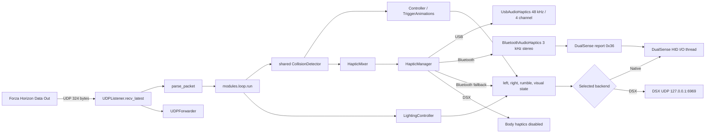

# FH-DualSense-Enhanced 架构说明

## 1. 项目定位

FH-DualSense-Enhanced 是一个运行在 PC 上的本地 Python 应用。它监听 Forza Horizon Data Out 的 UDP 遥测，根据车辆的刹车、油门、转速、轮胎、路面、悬挂和碰撞状态生成两类输出：

- L2/R2 自适应扳机效果。
- DualSense 握把触觉。USB 使用手柄四声道音频端点，Bluetooth 把同一左右 PCM 波形编码为 HID audio-haptics report `0x36`；失败时才使用 compatible rumble。
- 可选的转速灯带、红线闪烁和挡位 Player LEDs。
- 冻结后的 Windows 独立 EXE 内置 GitHub Release 检查、校验下载和重启替换；源码、Linux 与 ZUV 运行不自替换。

主要使用场景是玩家在 Windows 或 Linux 上运行 Forza Horizon，同时通过 USB 或 Bluetooth 连接 DualSense。程序也可把自适应扳机发送给本机 DSX，但 DSX 路径不提供本项目的握把触觉。英文用户说明见根 `README.md`，简体中文和日语分别见 `docs/ReadmeZH.md`、`docs/ReadmeJA.md`；实现入口见 `src/main.py`。

项目不是游戏插件，不注入游戏进程，也没有数据库或远程业务服务。游戏只通过 UDP 单向发送遥测，程序只在本机控制手柄或向配置的 UDP 目标转发原始包。

用户文档以 `Forza-Horizon-DualSense-Python 1.6.2` 作为能力比较基线。三语 README 描述当前 Enhanced 版本相对该基线的累计核心增强；单个 GitHub Release body 描述该版本相对上一稳定 Enhanced 版本的增量。前者回答“这个 fork 比上游多什么”，后者回答“这次更新比上一版多什么”，两者不得共用“本版新增”等含混措辞。README 的累计清单只总结用户可感知能力，具体实现和传输约束仍以本架构文档与代码为准。

## 2. 整体结构



`src/modules/loop.py` 是系统的运行时中枢。它不直接了解 USB 音频细节或 HID 字节布局，而是组合 Forza 效果计算、握把混音和后端输出。

## 3. 程序入口和运行模式

### 3.1 `src/main.py`

启动顺序如下：

1. 从当前工作目录加载 `./dev.env`。仓库中的 `src/dev.env` 目前只有注释，没有实际变量。
2. 创建 `Settings`，再由 `preferences.load()` 应用 global settings 和当前 Profile。
3. 偏好文件损坏时，CLI 询问是否备份为 `.bak` 并重建。
4. 处理 `--host`、`--port`、`--debug`、`--headless`、`--gui` 和 `--tui`。
5. 默认启动 `CustomTkinter` GUI。`--tui` 启动 Textual，`--headless` 在当前线程运行后端。

未捕获异常由 `_excepthook` 写入 `data/crash.log`。冻结 EXE 的可写 `data` 位于 EXE 旁边；源码和 ZUV 模式使用 `src/data` 或解包根目录下的 `data`。路径规则集中在 `src/modules/config/paths.py`。

### 3.2 GUI 和 TUI

`src/modules/gui/main.py` 和 `src/modules/tui/main.py` 都负责：

- 加载语言和配置。
- 创建 native HID 或 DSX 后端。
- 打开 UDP listener。
- 在 worker thread 中运行 `modules.loop.run()`。
- 管理共享 `UsbAudioHaptics` 生命周期。
- 在退出时依次停止 loop、音频、listener 和手柄。

GUI 的 Tk widget 只由主线程访问。后台日志进入最多 4000 条的 queue，再由 Tk 定时读取。最小化到托盘由 `settings.minimize_to_tray` 控制；窗口关闭、托盘退出、游戏关闭、遥测超时和更新重启都进入 `TriggerGUI.request_close()`，再由同一 teardown 顺序退出。托盘实现位于 `src/modules/gui/tray.py`。

Enhanced R4 只保留一个左侧导航壳层。其青绿色视觉来源在项目内部称为 Miku Console 设计理念，但当前产品名称、窗口标题和构建资产只使用 `FH-DualSense-Enhanced`。颜色与间距令牌集中在 `src/modules/gui/theme.py`，主强调色为 `#39C5BB`。长页面使用 `widgets.FastScroll` 注册到根窗口 `WheelRouter`：路由器按指针命中的最近祖先选择内层滚动画布，内层到达目标方向边界后才转交外层。驾驶反馈页的卡片保持自然高度，内容宽度低于阈值时只重新排列为单列，不重建开关。Per-Monitor v2 DPI awareness 和 CustomTkinter scaling 保持不变，裁切由滚动边界和响应式布局解决。

GUI 的 `src/modules/gui/about_tab.py` 和 TUI 的 `src/modules/tui/about_tab.py` 是独立的“关于与许可证”页面，均位于日志之后，复用 `src/modules/about.py` 的署名、原项目和 Sponsor URL。`settings_tab.py` 只负责握把触觉与调校，不再承载许可证卡片；总览页也不展示 Sponsor 或无功能的版本工作台。

### 3.3 Windows 独立 EXE 更新器

`src/modules/update/` 与触觉后端相互独立。`GitHubReleaseClient` 从 `piereacy/FH-DualSense-Enhanced` 的 Releases API 中筛选非 draft、非 prerelease 且 tag 严格匹配 `R<n>` 的版本，只接受规范资产 `FH-DualSense-Enhanced-R<n>.exe` 和配套 `.sha256`。API、校验文件和 EXE 都有限制大小与网络超时；下载先写 `.part`，完成后检查实际长度、SHA-256 和 `MZ` 头。

`UpdateService` 在后台线程维护 `IDLE -> CHECKING -> AVAILABLE|UP_TO_DATE|ERROR -> DOWNLOADING -> VERIFYING -> READY -> INSTALLING` 快照，GUI/TUI 只轮询不可变状态。自动检查默认开启并在启动约 10 秒后执行一次；后台下载默认关闭，安装始终需要用户点击“重启并安装”。当前实现没有跨启动的 24 小时检查节流，也不在应用内展开 Release body，只提供打开 Release 链接。

GUI 根据同一快照决定“系统与更新”导航白点。只有快照持有新 Release 且处于可用、下载、校验、待安装或错误状态时显示；进入页面不会清除。更新安装的 Helper 调度被延迟到统一退出提示完成之后，调度失败时主程序保持运行。

Windows 不能覆盖正在运行的主程序。`src/modules/update/install.py` 因此写入绝对路径、PID 与哈希的计划文件，复制内置 `FH-DualSense-Update-Helper.exe` 并退出。Helper 使用 Win32 `OpenProcess`/`WaitForSingleObject` 等待旧进程，先把旧 EXE 改名为 `.old`，再移动新文件并启动；失败时恢复 `.old`。入口由 `self_update_supported()` 限制为 `sys.frozen` 的 Windows 进程，源码、Linux 和 ZUV 界面的更新按钮被禁用。

## 4. 遥测输入层

### 4.1 UDP 监听

`src/modules/forzahorizon/udp_listener.py` 首先尝试绑定一个 `[::]:port` 的 dual-stack IPv6 socket，失败后回退到 `settings.udp_host:settings.udp_port` 的 IPv4 socket。默认端口为 `5300`，接收超时为 `0.5s`。

`recv_latest()` 先阻塞等待一个包，然后把 socket 临时设为 non-blocking 并排空队列，只返回最新包。这样做是为了降低控制反馈延迟，避免对积压的旧遥测逐帧反应。接收缓冲区设为 4096 字节。

启用 `udp_forward` 时，`UDPForwarder` 在同一热循环中把收到的每一个原始包转发到 `udp_forward_to` 中的 `host:port` 列表。转发失败只警告一次，不中断主循环。

### 4.2 324 字节数据模型

`parse_packet()` 使用固定 offset 把包解析为普通 `dict`，没有独立的 typed model。主要字段包括：

- 会话和车辆：`on`、`timestamp_ms`、`car_ordinal`、`drive_train`、`gear`。
- 动力：`rpm`、`idle_rpm`、`max_rpm`、`power`、`torque`、`boost`。
- 运动：`speed`、`accel_x/y/z`、速度、角速度和姿态。
- 四轮状态：轮速、slip ratio、slip angle、combined slip、surface rumble、puddle、rumble strip、悬挂行程。
- 输入：`accel`、`brake`、`clutch`、`handbrake` 和 `steer`。

速度在解析时从 m/s 转为 km/h。当前代码按 `PACKET_SIZE = 324` 判断预期包长，offset 依据 Forza Data Out 格式和 FH6 新增字段固定。修改 offset 会同时影响扳机、握把和测试，不能当作普通重构处理。

## 5. 自适应扳机子系统

### 5.1 游戏无关 primitive

`src/modules/dualsense/adaptive_trigger.py` 把一个扳机效果表示为：

```text
(mode_byte, params_tuple)
```

该层提供 `off`、`rigid`、`vibrate`、`rigid_zones`、`vibrate_zones` 以及 firmware 的 bow、gallop、machine、weapon 等 primitive，不包含 Forza 判断。

### 5.2 Forza 效果和优先级

`src/modules/forzahorizon/effects.py` 的 `TriggerAnimations` 保存换挡、通用抓地力 EWMA/hysteresis 和 ABS hold deadline 等跨帧状态。`Controller` 每个遥测 tick 只计算一次抓地力 effect，再按踏板状态路由到 L2 或 R2 frame；两侧仍采用 first-match priority，较高优先级会遮蔽后续效果。遥测 `on=False` 时会复位这些 transient state 和两侧 wall latch，防止恢复后沿用旧效果。

当前 L2 顺序：

1. 可选碰撞扳机冲击。
2. 换挡冲击。
3. GT7 风格 ABS zoned wall：顶部 zone 保持满强度 wall，下部 zone 动态振动。
4. 仅踩刹车时的通用纵向抓地力反馈。
5. 接近行程末端的 firmware wall。
6. 可选静态刹车 wall。
7. 刹车阻力曲线。
8. L2 未踩下且以上均无输出时的可选路面/减速带纹理。

当前 R2 扳机键顺序：

1. 可选碰撞扳机冲击。
2. 换挡冲击。
3. 原地轻踩油门 idle buzz。
4. 踩油门或同时踩下两块踏板时的通用纵向抓地力反馈。
5. 踩住油门时的红线震动。
6. 接近行程末端的 firmware wall。
7. 涡轮增压、G 力与普通油门阻力的合成 ramp；新增两层均默认关闭。
8. R2 扳机键未踩下且以上均无输出时的可选路面/减速带纹理。

通用抓地力的踏板来源是 Forza Data Out 的 `brake`/`accel`，不是 DualSense input report。只踩刹车时路由到 L2，只踩油门时路由到 R2，同时踩下时只路由到 R2；ABS 是独立的 L2 高优先级 effect，因此双踏板状态可同时输出 L2 ABS 和 R2 抓地力。高于 `LOW_SPEED_KMH` 时，油门单独使用 driven wheel longitudinal `tire_slip_ratio_*`，刹车参与时使用四轮最大绝对纵向滑移。低速只有油门参与时才用 driven wheel raw rotation 识别烧胎，低速纯刹车不会用 rotation 猜测抓地力。

抓地力继续复用 R2 已验证的一套 threshold、hysteresis 和按真实 `dt` 计算的非对称 EWMA，默认约 40 ms attack、125 ms release。主导车轮的 puddle 与 `surface_rumble` 选择 tarmac、water、dirt、gravel 频带，G force 只对 amplitude 作最多约 30% 的反向 damping。为兼容既有 Profile，设置字段仍使用 `wheelspin_*` 内部名称；UI 和文档使用 traction/grip 术语。

ABS 以四轮 longitudinal slip ratio 为主、combined slip 为低权重辅助。`abs_min_speed_kmh` 只负责低速 gating，pulse frequency 和 strength 由 normalized slip 决定，并用 `abs_hold_ms` 保留短暂 deadline。native USB/BT 输出 `vibrate_zones()`，默认顶部 3 个 zone 为满强度 wall；DSX 无法保留该 wall，`src/modules/dsx/dsx_wrapper.py` 明确退化为随 frequency 变化的 `TM_VIBRATE`。

## 6. 握把触觉子系统

### 6.1 传输无关 frame

`src/modules/haptics/frame.py` 定义不可变的 `HapticFrame`：

- `left_low`、`left_high`
- `right_low`、`right_high`
- `engine_hz`、`engine_amplitude`
- 可选的 `compatible_low_frequency`、`compatible_high_frequency`

所有幅度最终通过 `clamp01()` 限制到 `0..1`。`CompatibleRumble` 只有 low/high 两个通道，现在只用于 Bluetooth `0x36` 后端无法启动或被当前连接拒绝时的回退。可选 compatible 字段由需要在回退中尽量保留侧别的高优先级事件填写；它们不参与正常 USB 或 Bluetooth HD haptics PCM。

### 6.2 `HapticMixer`

`src/modules/haptics/mixer.py` 从同一份 telemetry 计算 engine、红线警告、路面、rumble strip、积水、轮胎打滑、悬挂、碰撞、换挡和 ABS 的左右能量。`src/modules/loop.py` 每帧只运行一次 `CollisionDetector`，同一 `CollisionSignal` 同时交给握把混音与可选 L2/R2 扳机冲击，避免两套阈值在同一次碰撞中产生分歧。

关键 gating 规则是：

- 真正静止、怠速且没有油门活动时保持安静。
- 原地轰油根据转速和油门产生 engine feedback。
- 低速烧胎使用 driven wheel raw rotation 判断接触激励。
- 路面材质只有车辆滚动或对应车轮实际空转时进入混音。
- 碰撞和悬挂冲击即使静止也保持左右方向性。
- 车辆滚动使用 `0.5 km/h` 进入、`0.2 km/h` 退出的 hysteresis，避免零速附近抖动。
- 握把红线要求油门达到 deadzone；`rpm / max_rpm` 默认在 `0.93` 进入、低于 `0.90` 退出，松开油门立即退出，不使用扳机红线的 hold。
- R2 扳机键红线默认关闭，握把红线默认开启。握把侧默认只在左握把输出 10 Hz、70% duty、`220/255` 峰值和 `45%` low 比例的断油脉冲；进入红线后的前 120 ms 还叠加默认 `0.65` 起始冲击。兼容字段 `grip_redline_gain=1.5` 不再线性相乘后硬削顶，而以 `1 - (1 - base)^gain` 调整感知曲线，使峰值滑块仍有有效行程。左右握把可独立启用，握把红线使用独立的 `enable_grip_redline_haptics`，不受 R2 扳机键 `enable_rev_limiter` 控制。
- 握把红线 active 时，连续路面和 engine 背景默认压至 `30%`，已启用的握把换挡、悬挂、ABS 等 transient 不随红线一起压低。进入和退出只记录状态边沿日志，不逐帧刷屏。
- 握把换挡冲击默认关闭。启用 `enable_grip_gear_shift_haptics` 后，速度高于 `3 km/h` 的正挡变化会按独立 `grip_gear_shift_strength` 和 `grip_gear_shift_duration_ms` 向左右 low 通道加入 centered transient。它不读取 R2 扳机键的换挡开关、强度或持续时间；关闭时立即清除 event deadline，但继续更新挡位基线以防重新开启后补发旧事件。
- 碰撞继续使用相邻帧 `accel_x/accel_z` jerk 和 `smashable_vel_diff` 两种检测源。事件按 `accel_x` 分配主侧和默认 `35%` 弱侧，150 ms 包络由主冲击、短间隔、弱回弹和释放组成。
- 碰撞触发后进入默认 250 ms cooldown，且检测源必须先全部回落才重新 arm，避免同一碰撞连续重触发。碰撞 active 时其余握把能量默认压至 `20%`；日志记录 source、jerk、smashable、intensity 和 direction。

这些规则对应 `tests/haptics/test_mixer.py`，其设计背景也记录在 `docs/superpowers/specs/2026-07-12-physical-body-haptics-gating-design.md`。

### 6.3 USB 路由

`src/modules/haptics/audio.py` 只选择满足以下条件的输出设备：

- Windows WASAPI 或 Linux ALSA host API。
- 至少四个输出声道。
- 名称包含 `dualsense` 或 `wireless controller`。

音频 stream 固定为 48 kHz、4 channel、float32、blocksize 512、low latency。`src/modules/haptics/pcm.py` 的 `HapticPcmRenderer` 生成左右双声道波形，callback 把它们写到 channel index 2 和 3，前两个通道保持静音。低频基波为 65 Hz，高频基波为 190 Hz，engine 在约 40 到 120 Hz 间随 RPM 变化。幅度每个 512-frame block 以固定系数 `0.35` 平滑。

GUI 和 TUI 通过 `UsbAudioLifecycle` 每秒检查 USB eligibility 并重试启动。headless 模式由 `HapticManager` 在首次路由时创建和启动音频后端。

### 6.4 Bluetooth 路由

Bluetooth 不依赖 Windows 音频 endpoint。`src/modules/haptics/bt_audio.py` 以 3 kHz、每块 32 帧调用与 USB 相同的 `HapticPcmRenderer`。USB 的 512 / 48000 与 Bluetooth 的 32 / 3000 都是约 10.667 ms，因此低频、高频、engine、左右混音和 `0.35` 平滑位于相同时间尺度。Bluetooth renderer 在量化前使用归一化 `tanh` 软限幅，减少多层叠加被硬裁剪成方波；`BluetoothPcmQuantizer` 以默认 `0.75` 一阶误差反馈量化为 64 字节交错 signed int8，使低幅细节在多个采样间保留平均能量。USB 仍使用 float32 PCM 的常规 `[-1, 1]` 安全裁剪。

`src/modules/dualsense/bt_haptics.py` 构建 398 字节 report `0x36`：63 字节 state block 携带当前 L2/R2 扳机状态，64 字节 haptics block 携带左右采样，bytes 142..393 不声明 controller-speaker block，末尾四字节使用 Bluetooth output prefix `0xA2` 的 CRC32。report sequence 以 4 bit 回绕，audio packet sequence 以 8 bit 回绕。

Bluetooth renderer 线程不直接写 hidapi。它把最新采样放入 `DualSense` 单槽队列并唤醒已有 I/O 线程，普通 `0x31` 状态和 `0x36` 音频触觉由同一线程串行写入。周期等待必须使用 Python 3.13 的高精度 `time.sleep()`；Windows 下 `threading.Event.wait(10.667 ms)` 会受约 15.6 ms 系统计时粒度影响，实测只能达到约 65 Hz。I/O event 在清除后必须再次检查 pending state，避免丢失 producer wake。

如果构建、队列或 `0x36` HID write 失败，`HapticManager` 在当前连接回退到 `to_compatible_rumble()`。这时普通反馈仍按 low/high 频率下混，红线和碰撞可使用 `compatible_low_frequency`、`compatible_high_frequency` 尽量保存侧别。重新连接 Bluetooth 后清除失败状态并重新尝试 HD haptics。

禁用 body haptics、切换 transport 或断开时，HD 路径发送全零采样块；compatible fallback 发送一次全零 rumble 释放 motor ownership。`DualSense` 仍保留 pending compatible release，确保后续 trigger-only frame 不会吞掉释放帧。此路径只传输本项目从遥测合成的握把触觉，不包含 vDS 的虚拟 USB、filter driver、speaker、microphone 或游戏原生触觉接管。

### 6.5 DSX 限制

`src/modules/dsx/client.py` 通过 UDP 向默认 `127.0.0.1:6969` 发送 trigger instruction。协议没有 ACK，因此 `connected` 只表示 UDP socket 已创建。`src/modules/dsx/dsx_wrapper.py` 把项目的 trigger frame 映射为 DSX mode。

DSX 拥有手柄时，`HapticManager` 明确关闭本项目 body haptics。当前没有 DSX 握把触觉回退路径。`M_VIBRATE_ZONES` 在 DSX 中只能退化为 `TM_VIBRATE`，因此 R2 ABS 仍有动态振动，但没有 native USB/BT 的顶部 zoned wall。

## 7. Native DualSense 输出

`src/modules/dualsense/main.py` 负责 DualSense 和 DualSense Edge 的 HID 枚举、选择、连接、写入和重连。

- 只选择 usage page 1、usage 5 的 gamepad interface。
- 同一手柄同时出现 USB 和 BT 时优先 USB。
- USB 报告为 64 字节，report ID `0x02`。
- BT 报告为 78 字节，report ID `0x31`，写入前计算带 `0xA2` seed 的 CRC32。
- BT HD haptics 报告为 398 字节，report ID `0x36`，使用同一 Bluetooth CRC 规则；HID descriptor 必须接受该 report ID 和长度。
- trigger flags 始终声明 L2/R2；只有传入 rumble 时才声明 motor flags。
- `ControllerVisualState` 的 `lightbar` 与 `player_leds` 使用 `None` 表示不占用该字段、显式零表示清除。状态同时写入 USB `0x02`、普通 BT `0x31` 和 BT haptics `0x36` 的 state block；DSX 路径不写灯光。
- I/O thread 等待 `set()` 或 Bluetooth haptics queue 唤醒，避免 busy polling，并在 disconnected 状态按间隔枚举设备。Bluetooth 音频队列只保留最新块，防止旧触觉补发增加延迟。

`persistent` 的实际判定是连接过一次后满足 `HidHide detected OR auto-reconnect off`。persistent 时保留 handle、跳过 input watchdog 并吞掉瞬时读写错误。该行为对默认关闭 auto-reconnect 的用户也生效，不只针对 HidHide。

HidHide 模块只检查环境变量、PATH 和默认安装路径，不调用外部 CLI。Linux 不使用 PyPI hidapi 的 libusb 路径，而由 `src/modules/dualsense/_hidraw.py` 直接访问 `/dev/hidraw`，因此需要 udev 权限。

## 8. 配置、Profile 和持久化

### 8.1 `Settings`

所有默认值位于 `src/modules/config/settings.py`。运行中的 GUI/TUI slider 直接修改同一个 `Settings` 实例，热循环下一帧即可读取多数变化。

Enhanced R4 普通设置分别显示 R2 扳机键红线、握把红线、traction/grip、R2 扳机键换挡和握把换挡的常用参数；普通“驾驶反馈”控制页只显示成熟效果的开关，并提供左右握把选择。握把换挡开关、强度和持续时间属于普通设置。涡轮增压阻力、G 力阻力、L2/R2 碰撞扳机冲击和 L2/R2 空闲路面纹理的六个开关及全部基础、进阶参数统一位于 GUI/TUI 默认折叠的实验性区域；握把红线曲线、起始冲击、碰撞包络以及 traction/ABS 的低层参数也留在该区域，全部属于 Profile。灯效有独立页面，转速灯带与挡位 Player LEDs 默认关闭。两套 UI 仍重复声明字段，由设置、翻译、Profile/share-code、分组契约和 TUI 挂载测试保证一致。

### 8.2 `user_preferences.json`

`src/modules/config/preferences.py` 使用以下逻辑：

- `GLOBAL_FIELDS` 保存 UDP、重连、启动 pulse、后台行为、语言、更新、手柄选择和 DSX 等应用级设置。
- 其余简单类型字段属于当前 Profile。
- `Default` 与命名 Profile 都会自动保存并跨启动保留，启动过程不再用 `Settings()` 覆盖 `Default`。
- 第一次生成有效配置时，`system_language.detect_system_language()` 把 Windows 显示语言映射到现有 `en/de/ja/ru/tr/zh/zh_tw` 目录；已有配置继续使用用户选择。
- `ProfileSession` 只在内存中保存 GUI 启动时的 `Default` Profile 快照。当前仍为 `Default` 且 Profile 字段发生变化时，统一退出入口才提示另存命名 Profile；global-only 变化和当前命名 Profile 不提示。
- 恢复出厂会先备份现有 JSON 为 `.bak`，保留全部命名 Profile，重建 `Default` 和 globals，切回 `Default` 并重新检测系统语言。只有原子写入成功后才修改运行中的 `Settings`。
- 旧命名 Profile 保留原 `rev_limit_*` 扳机参数；缺失的 R4 字段按当前默认值补齐，因此所有新增扳机层与灯效默认关闭，握把换挡仍默认关闭。已经显式保存的值不会被覆盖。
- 早期内部版本 `3` 预览曾复用 `rev_limit_*` 作为握把参数。缺少新握把 marker 的预览 Profile 会执行一次拆分迁移：已知 `10/96` 预览默认恢复为扳机 `30/12` 并采用新握把 `10/192`；自定义值复制给握把且继续保留在扳机侧。已有新字段时迁移保持幂等。
- 写入先生成 `.tmp` 再 replace，降低中途损坏风险。
- 写入函数返回成功状态，Profile CRUD 不在写入失败时伪报成功或提前修改运行对象。
- 损坏文件可备份为 `.bak` 后重建。

`src/modules/config/profiles.py` 提供命名 Profile CRUD，以及以 `FHDS:` 开头的 zlib + URL-safe base64 分享码。分享码只保存偏离默认值的字段，导入时丢弃未知字段并补齐当前默认值。

项目没有数据库、账号系统或加密配置存储。Profile 只是本地 JSON。

## 9. 退出、错误和日志

- `ProcessWatcher` 每隔 `game_poll_interval_s` 扫描进程名或可执行文件路径，只有先看到包含 `forza` 的进程、随后看不到时才要求退出。
- 收到过遥测后，连续 1 秒无包会静音。启用 `exit_on_game_close` 时，连续 `telemetry_lost_exit_s` 无包会作为退出 fallback；关闭该选项时，进程检测和 telemetry-lost 退出都禁用，应用继续等待遥测恢复。尚未收到过包时只周期性警告，不自动退出。
- UDP bind 失败会在 GUI/TUI 显示端口占用状态。
- controller、mixer 和 haptics 路由分别捕获异常，握把失败不应阻塞扳机输出。
- GUI 使用 queue log handler，TUI 使用 Textual bridge，headless 使用 console logging。
- GUI 的 `ProfileSession` 关闭提示不是未落盘警告：`Default` 已经即时写盘，它提供的是退出前创建可复用命名快照的机会。强制结束进程、崩溃或断电无法显示该提示。
- 多处硬件清理和 UI teardown 使用 best-effort exception suppression，避免退出失败，但也可能隐藏设备特有问题。

## 10. 环境变量和外部依赖

| 名称 | 用途 |
| --- | --- |
| `IS_ZUV` | 由 ZUV loader 设置，应用只打印检测状态 |
| `UPDATE_REPO` | 本地 ZUV 构建脚本的可选更新仓库 |
| `HIDHIDE_CLI` | 指向 HidHideCLI 的探测路径，不执行该文件 |
| `PYSTRAY_BACKEND` | Linux tray backend；Wayland 下默认设为 `appindicator` |
| `PYTHONHOME`、`PYTHONPATH`、`PYTHONNOUSERSITE`、`UV_PYTHON_PREFERENCE` | launcher 隔离 host Python 并要求 uv managed Python |

外部系统包括 Forza UDP、DualSense HID/audio device、本机 DSX UDP 和 GitHub Releases。Windows 独立 EXE 更新器校验 Release 配套 SHA-256，但没有代码签名信任链；ZUV launcher 会从同一仓库下载并执行 bundle，现有 BAT/ZUV 下载链路没有独立 checksum 或 signature 验证。这两条链路具有不同的供应链保证，不能混写成同一机制。

## 11. 关键设计约束

- 低延迟优先于完整处理所有遥测包，因此必须保留 `recv_latest()` drain 策略。
- trigger 和 body haptics 共享 telemetry tick，但保持独立计算和容错，body haptics 故障不能让 trigger 停止。
- USB audio endpoint 和 Bluetooth `0x36` 是不同传输，但必须复用 `HapticPcmRenderer` 的左右波形语义；不能把任一传输的字节或声道布局写入 `HapticMixer`。
- native HID 和 DSX 共享 `open/close/set/connected` 最小接口，loop 不应按具体类分支，能力差异通过 `is_dsx` 和 transport 表达。
- HID 报告中的 offsets、flags、左右映射和 BT CRC 是协议边界，不应因代码美化而改变。
- GUI/TUI 与 backend 分线程，Tk widget 不得在 worker thread 直接更新。
- 当前青绿色 GUI 是唯一壳层；Miku Console 只表示老三样中记录的内部设计来源，不是产品名称。不得重新引入构建时界面分叉、界面 marker 或多资产更新契约。
- 更新 Helper 是唯一允许替换运行中 EXE 的路径；主程序不得自行覆盖 `sys.executable`，更新目标必须使用规范文件名。
- `Default` 持久化和 named/global 字段边界属于配置兼容协议；新默认值不能通过启动时强制覆盖已经保存的用户值。
- Profile 的 global 和 per-profile 边界是兼容性协议，修改字段归属需要迁移和 round-trip 测试。
- 许可证和第三方声明属于发布要求，不是可选 UI 文案。

## 12. 已知架构缺陷和技术债

- 遥测使用未类型化 `dict`，字段名错误只能在运行时暴露。
- GUI 和 TUI 各自维护设置 section，依赖测试保证字段一致，新增设置容易漏改一侧。
- DSX 无 ACK，无法判断 DSX 是否真正监听，也不支持本项目 body haptics。
- USB 音频设备按名称和第一个匹配项选择，没有用户可选 endpoint，也没有多级 host API fallback。
- Bluetooth HD haptics 的公开协议资料有限，目前以 vDS `0.3.0-rc7`、DS5Dongle 和真实 DualSense report descriptor/硬件探针交叉验证；不同旧固件或蓝牙适配器仍可能触发 compatible fallback。
- `ProcessWatcher` 仅按 `forza` 子串匹配，存在误匹配其他进程的可能。
- 多处 best-effort `except` 只写 debug 或直接忽略，硬件边缘问题的诊断信息有限。
- 英文、简体中文和日语用户指南是三个独立文件，共享事实仍需人工同步；`tests/test_enhanced_distribution.py` 只校验关键事实和篇幅，不能发现翻译语义的全部漂移。
- 更新器目前每次启动都会在约 10 秒后检查，没有实现设计稿中的跨启动 24 小时节流；Release body 只通过浏览器链接查看，也尚未解析 PE 版本资源或使用代码签名验证。
- `src/lang/` 仍保留已不再由 GUI/TUI 使用的旧 ZUV sentinel 文案，属于无害但应后续清理的翻译债务。
- `packaging/linux/build_elf.sh` 的本地 `uvx` 参数未显式包含 `numpy` 和 `sounddevice`，而 CI Linux build 包含。该本地构建是否失败尚未实际验证，状态为待确认。
- `src/modules/config/settings.py` 称同一手柄的 USB 和 BT serial 不同，但 `src/modules/dualsense/main.py` 会读取 USB feature report 填入 BT MAC 并据此去重。该注释需要核实后修正。
