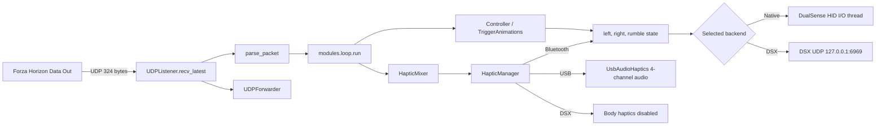

# FH-DualSense-Enhanced 架构说明

## 1. 项目定位

FH-DualSense-Enhanced 是一个运行在 PC 上的本地 Python 应用。它监听 Forza Horizon Data Out 的 UDP 遥测，根据车辆的刹车、油门、转速、轮胎、路面、悬挂和碰撞状态生成两类输出：

- L2/R2 自适应扳机效果。
- DualSense 握把触觉。USB 使用手柄四声道音频端点，Bluetooth 使用 HID compatible rumble。

主要使用场景是玩家在 Windows 或 Linux 上运行 Forza Horizon，同时通过 USB 或 Bluetooth 连接 DualSense。程序也可把自适应扳机发送给本机 DSX，但 DSX 路径不提供本项目的握把触觉。用户说明见 `README.md`，实现入口见 `src/main.py`。

项目不是游戏插件，不注入游戏进程，也没有数据库或远程业务服务。游戏只通过 UDP 单向发送遥测，程序只在本机控制手柄或向配置的 UDP 目标转发原始包。

## 2. 整体结构



`src/modules/loop.py` 是系统的运行时中枢。它不直接了解 USB 音频细节或 HID 字节布局，而是组合 Forza 效果计算、握把混音和后端输出。

## 3. 程序入口和运行模式

### 3.1 `src/main.py`

启动顺序如下：

1. 从当前工作目录加载 `./dev.env`。仓库中的 `src/dev.env` 目前只有注释，没有实际变量。
2. 创建 `Settings`，再由 `preferences.load()` 应用 global settings 和当前 Profile。
3. 偏好文件损坏时，CLI 询问是否备份为 `.bak` 并重建。
4. 处理 `--host`、`--port`、`--debug`、`--headless`、`--gui` 和 `--tui`。
5. 默认启动 `CustomTkinter` GUI。`--tui` 启动 Textual，`--headless` 在当前线程运行后端。

未捕获异常由 `_excepthook` 写入 `data/crash.log`。冻结 EXE 的可写 `data` 位于 EXE 旁边；源码和 ZUV 模式使用 `src/data` 或解包根目录下的 `data`。路径规则集中在 `src/modules/config/paths.py`。

### 3.2 GUI 和 TUI

`src/modules/gui/main.py` 和 `src/modules/tui/main.py` 都负责：

- 加载语言和配置。
- 创建 native HID 或 DSX 后端。
- 打开 UDP listener。
- 在 worker thread 中运行 `modules.loop.run()`。
- 管理共享 `UsbAudioHaptics` 生命周期。
- 在退出时依次停止 loop、音频、listener 和手柄。

GUI 的 Tk widget 只由主线程访问。后台日志进入最多 4000 条的 queue，再由 Tk 定时读取。最小化到托盘由 `settings.minimize_to_tray` 控制，关闭窗口始终退出；游戏关闭后退出由 loop 中的 `settings.exit_on_game_close` 控制。托盘实现位于 `src/modules/gui/tray.py`。

## 4. 遥测输入层

### 4.1 UDP 监听

`src/modules/forzahorizon/udp_listener.py` 首先尝试绑定一个 `[::]:port` 的 dual-stack IPv6 socket，失败后回退到 `settings.udp_host:settings.udp_port` 的 IPv4 socket。默认端口为 `5300`，接收超时为 `0.5s`。

`recv_latest()` 先阻塞等待一个包，然后把 socket 临时设为 non-blocking 并排空队列，只返回最新包。这样做是为了降低控制反馈延迟，避免对积压的旧遥测逐帧反应。接收缓冲区设为 4096 字节。

启用 `udp_forward` 时，`UDPForwarder` 在同一热循环中把收到的每一个原始包转发到 `udp_forward_to` 中的 `host:port` 列表。转发失败只警告一次，不中断主循环。

### 4.2 324 字节数据模型

`parse_packet()` 使用固定 offset 把包解析为普通 `dict`，没有独立的 typed model。主要字段包括：

- 会话和车辆：`on`、`timestamp_ms`、`car_ordinal`、`drive_train`、`gear`。
- 动力：`rpm`、`idle_rpm`、`max_rpm`、`power`、`torque`、`boost`。
- 运动：`speed`、`accel_x/y/z`、速度、角速度和姿态。
- 四轮状态：轮速、slip ratio、slip angle、combined slip、surface rumble、puddle、rumble strip、悬挂行程。
- 输入：`accel`、`brake`、`clutch`、`handbrake` 和 `steer`。

速度在解析时从 m/s 转为 km/h。当前代码按 `PACKET_SIZE = 324` 判断预期包长，offset 依据 Forza Data Out 格式和 FH6 新增字段固定。修改 offset 会同时影响扳机、握把和测试，不能当作普通重构处理。

## 5. 自适应扳机子系统

### 5.1 游戏无关 primitive

`src/modules/dualsense/adaptive_trigger.py` 把一个扳机效果表示为：

```text
(mode_byte, params_tuple)
```

该层提供 `off`、`rigid`、`vibrate`、`rigid_zones`、`vibrate_zones` 以及 firmware 的 bow、gallop、machine、weapon 等 primitive，不包含 Forza 判断。

### 5.2 Forza 效果和优先级

`src/modules/forzahorizon/effects.py` 的 `TriggerAnimations` 保存换挡、通用抓地力 EWMA/hysteresis 和 ABS hold deadline 等跨帧状态。`Controller` 每个遥测 tick 只计算一次抓地力 effect，再按踏板状态路由到 L2 或 R2 frame；两侧仍采用 first-match priority，较高优先级会遮蔽后续效果。遥测 `on=False` 时会复位这些 transient state 和两侧 wall latch，防止恢复后沿用旧效果。

当前 L2 顺序：

1. 换挡冲击。
2. GT7 风格 ABS zoned wall：顶部 zone 保持满强度 wall，下部 zone 动态振动。
3. 仅踩刹车时的通用纵向抓地力反馈。
4. 接近行程末端的 firmware wall。
5. 可选静态刹车 wall。
6. 刹车阻力曲线。

当前 R2 扳机键顺序：

1. 换挡冲击。
2. 原地轻踩油门 idle buzz。
3. 踩油门或同时踩下两块踏板时的通用纵向抓地力反馈。
4. 接近行程末端的 firmware wall。
5. 油门阻力曲线。

通用抓地力的踏板来源是 Forza Data Out 的 `brake`/`accel`，不是 DualSense input report。只踩刹车时路由到 L2，只踩油门时路由到 R2，同时踩下时只路由到 R2；ABS 是独立的 L2 高优先级 effect，因此双踏板状态可同时输出 L2 ABS 和 R2 抓地力。高于 `LOW_SPEED_KMH` 时，油门单独使用 driven wheel longitudinal `tire_slip_ratio_*`，刹车参与时使用四轮最大绝对纵向滑移。低速只有油门参与时才用 driven wheel raw rotation 识别烧胎，低速纯刹车不会用 rotation 猜测抓地力。

抓地力继续复用 R2 已验证的一套 threshold、hysteresis 和按真实 `dt` 计算的非对称 EWMA，默认约 40 ms attack、125 ms release。主导车轮的 puddle 与 `surface_rumble` 选择 tarmac、water、dirt、gravel 频带，G force 只对 amplitude 作最多约 30% 的反向 damping。为兼容既有 Profile，设置字段仍使用 `wheelspin_*` 内部名称；UI 和文档使用 traction/grip 术语。

ABS 以四轮 longitudinal slip ratio 为主、combined slip 为低权重辅助。`abs_min_speed_kmh` 只负责低速 gating，pulse frequency 和 strength 由 normalized slip 决定，并用 `abs_hold_ms` 保留短暂 deadline。native USB/BT 输出 `vibrate_zones()`，默认顶部 3 个 zone 为满强度 wall；DSX 无法保留该 wall，`src/modules/dsx/dsx_wrapper.py` 明确退化为随 frequency 变化的 `TM_VIBRATE`。

## 6. 握把触觉子系统

### 6.1 传输无关 frame

`src/modules/haptics/frame.py` 定义不可变的 `HapticFrame`：

- `left_low`、`left_high`
- `right_low`、`right_high`
- `engine_hz`、`engine_amplitude`

所有幅度最终通过 `clamp01()` 限制到 `0..1`。`CompatibleRumble` 只有 low/high 两个通道，用于 Bluetooth HID 报告。

### 6.2 `HapticMixer`

`src/modules/haptics/mixer.py` 从同一份 telemetry 计算 engine、红线警告、路面、rumble strip、积水、轮胎打滑、悬挂、碰撞、换挡和 ABS 的左右能量。

关键 gating 规则是：

- 真正静止、怠速且没有油门活动时保持安静。
- 原地轰油根据转速和油门产生 engine feedback。
- 低速烧胎使用 driven wheel raw rotation 判断接触激励。
- 路面材质只有车辆滚动或对应车轮实际空转时进入混音。
- 碰撞和悬挂冲击即使静止也保持左右方向性。
- 车辆滚动使用 `0.5 km/h` 进入、`0.2 km/h` 退出的 hysteresis，避免零速附近抖动。
- 红线警告要求油门达到 deadzone 且 `rpm / max_rpm >= rev_limit_ratio`，默认以双侧同步 10 Hz、50% duty 的 high-channel 断油脉冲叠加在连续 engine feedback 上，跌破阈值后保持 120 ms。
- 红线警告服从 Body Haptics 总开关、master、`engine_haptics_intensity` 和 `enable_rev_limiter`；关闭效果或发动机强度时会立即清除 hold。

这些规则对应 `tests/haptics/test_mixer.py`，其设计背景也记录在 `docs/superpowers/specs/2026-07-12-physical-body-haptics-gating-design.md`。

### 6.3 USB 路由

`src/modules/haptics/audio.py` 只选择满足以下条件的输出设备：

- Windows WASAPI 或 Linux ALSA host API。
- 至少四个输出声道。
- 名称包含 `dualsense` 或 `wireless controller`。

音频 stream 固定为 48 kHz、4 channel、float32、blocksize 512、low latency。callback 把左、右混音写到 channel index 2 和 3，前两个通道保持静音。低频基波为 65 Hz，高频基波为 190 Hz，engine 在约 40 到 120 Hz 间随 RPM 变化。幅度在 callback 中进行固定系数平滑。

GUI 和 TUI 通过 `UsbAudioLifecycle` 每秒检查 USB eligibility 并重试启动。headless 模式由 `HapticManager` 在首次路由时创建和启动音频后端。

### 6.4 Bluetooth 路由

Bluetooth 没有使用音频 endpoint。`to_compatible_rumble()` 把左右 `HapticFrame` 下混为 low/high 两个 motor 值，再由 native HID writer 与扳机 frame 原子写入。USB 与 Bluetooth 的红线判断、phase、hold 和归一化强度来自同一个 `HapticFrame`；架构只区分底层合成与传输路径，不定义强弱或高低配行为。

禁用 body haptics 或切换 transport 时，`HapticManager` 必须发送一次全零 compatible rumble 释放 motor ownership。`DualSense` 内部保留 pending release，确保紧随其后的 trigger-only frame 不会把释放帧合并掉。

### 6.5 DSX 限制

`src/modules/dsx/client.py` 通过 UDP 向默认 `127.0.0.1:6969` 发送 trigger instruction。协议没有 ACK，因此 `connected` 只表示 UDP socket 已创建。`src/modules/dsx/dsx_wrapper.py` 把项目的 trigger frame 映射为 DSX mode。

DSX 拥有手柄时，`HapticManager` 明确关闭本项目 body haptics。当前没有 DSX 握把触觉回退路径。`M_VIBRATE_ZONES` 在 DSX 中只能退化为 `TM_VIBRATE`，因此 R2 ABS 仍有动态振动，但没有 native USB/BT 的顶部 zoned wall。

## 7. Native DualSense 输出

`src/modules/dualsense/main.py` 负责 DualSense 和 DualSense Edge 的 HID 枚举、选择、连接、写入和重连。

- 只选择 usage page 1、usage 5 的 gamepad interface。
- 同一手柄同时出现 USB 和 BT 时优先 USB。
- USB 报告为 64 字节，report ID `0x02`。
- BT 报告为 78 字节，report ID `0x31`，写入前计算带 `0xA2` seed 的 CRC32。
- trigger flags 始终声明 L2/R2；只有传入 rumble 时才声明 motor flags。
- I/O thread 等待 `set()` 唤醒，避免 busy polling，并在 disconnected 状态按间隔枚举设备。

`persistent` 的实际判定是连接过一次后满足 `HidHide detected OR auto-reconnect off`。persistent 时保留 handle、跳过 input watchdog 并吞掉瞬时读写错误。该行为对默认关闭 auto-reconnect 的用户也生效，不只针对 HidHide。

HidHide 模块只检查环境变量、PATH 和默认安装路径，不调用外部 CLI。Linux 不使用 PyPI hidapi 的 libusb 路径，而由 `src/modules/dualsense/_hidraw.py` 直接访问 `/dev/hidraw`，因此需要 udev 权限。

## 8. 配置、Profile 和持久化

### 8.1 `Settings`

所有默认值位于 `src/modules/config/settings.py`。运行中的 GUI/TUI slider 直接修改同一个 `Settings` 实例，热循环下一帧即可读取多数变化。

R3 普通设置显示 ABS、红线握把警告和 traction/grip 的常用参数。threshold、frequency band、EWMA、G damping、hysteresis、burnout 和 ABS wall/hold 参数位于 GUI/TUI 默认折叠的 `EXPERIMENTAL_SECTIONS`，并保持 Profile 级。两套 UI 仍重复声明字段，由 `tests/test_haptic_settings.py` 检查字段顺序、翻译、Profile/share-code round-trip 和 TUI 实际挂载状态。

### 8.2 `user_preferences.json`

`src/modules/config/preferences.py` 使用以下逻辑：

- `GLOBAL_FIELDS` 保存 UDP、重连、启动 pulse、后台行为、语言、更新、手柄选择和 DSX 等应用级设置。
- 其余简单类型字段属于当前 Profile。
- `Default` Profile 每次启动都从当前 `Settings()` 默认值重新生成，便于发布新的默认调校。
- 命名 Profile 和 globals 在启动间保留。
- 读取内部版本 `2` 的命名 Profile 时，仅把仍等于旧红线默认值 `30/12` 的 frequency/amplitude 迁移为 R3 的 `10/96`；用户自定义值不覆盖。
- 写入先生成 `.tmp` 再 replace，降低中途损坏风险。
- 损坏文件可备份为 `.bak` 后重建。

`src/modules/config/profiles.py` 提供命名 Profile CRUD，以及以 `FHDS:` 开头的 zlib + URL-safe base64 分享码。分享码只保存偏离默认值的字段，导入时丢弃未知字段并补齐当前默认值。

项目没有数据库、账号系统或加密配置存储。Profile 只是本地 JSON。

## 9. 退出、错误和日志

- `ProcessWatcher` 每隔 `game_poll_interval_s` 扫描进程名或可执行文件路径，只有先看到包含 `forza` 的进程、随后看不到时才要求退出。
- 收到过遥测后，连续 1 秒无包会静音。启用 `exit_on_game_close` 时，连续 `telemetry_lost_exit_s` 无包会作为退出 fallback；关闭该选项时，进程检测和 telemetry-lost 退出都禁用，应用继续等待遥测恢复。尚未收到过包时只周期性警告，不自动退出。
- UDP bind 失败会在 GUI/TUI 显示端口占用状态。
- controller、mixer 和 haptics 路由分别捕获异常，握把失败不应阻塞扳机输出。
- GUI 使用 queue log handler，TUI 使用 Textual bridge，headless 使用 console logging。
- 多处硬件清理和 UI teardown 使用 best-effort exception suppression，避免退出失败，但也可能隐藏设备特有问题。

## 10. 环境变量和外部依赖

| 名称 | 用途 |
| --- | --- |
| `IS_ZUV` | 由 ZUV loader 设置，应用只打印检测状态 |
| `ZUV_CACHE_ROOT` | GUI/TUI 用于创建或删除 `.zuv-update-disabled` sentinel |
| `UPDATE_REPO` | 本地 ZUV 构建脚本的可选更新仓库 |
| `HIDHIDE_CLI` | 指向 HidHideCLI 的探测路径，不执行该文件 |
| `PYSTRAY_BACKEND` | Linux tray backend；Wayland 下默认设为 `appindicator` |
| `PYTHONHOME`、`PYTHONPATH`、`PYTHONNOUSERSITE`、`UV_PYTHON_PREFERENCE` | launcher 隔离 host Python 并要求 uv managed Python |

外部系统包括 Forza UDP、DualSense HID/audio device、本机 DSX UDP 和 GitHub Releases。ZUV launcher 会从 `piereacy/FH-DualSense-Enhanced` 下载并执行 bundle，构建和更新链路当前没有在脚本中进行独立 checksum 或 signature 验证。这是发布供应链的现有信任边界。

## 11. 关键设计约束

- 低延迟优先于完整处理所有遥测包，因此必须保留 `recv_latest()` drain 策略。
- trigger 和 body haptics 共享 telemetry tick，但保持独立计算和容错，body haptics 故障不能让 trigger 停止。
- USB 音频和 Bluetooth rumble 是两个不同 transport，不能把 USB 的四通道假设写入 `HapticMixer`。
- native HID 和 DSX 共享 `open/close/set/connected` 最小接口，loop 不应按具体类分支，能力差异通过 `is_dsx` 和 transport 表达。
- HID 报告中的 offsets、flags、左右映射和 BT CRC 是协议边界，不应因代码美化而改变。
- GUI/TUI 与 backend 分线程，Tk widget 不得在 worker thread 直接更新。
- Profile 的 global 和 per-profile 边界是兼容性协议，修改字段归属需要迁移和 round-trip 测试。
- 许可证和第三方声明属于发布要求，不是可选 UI 文案。

## 12. 已知架构缺陷和技术债

- 遥测使用未类型化 `dict`，字段名错误只能在运行时暴露。
- GUI 和 TUI 各自维护设置 section，依赖测试保证字段一致，新增设置容易漏改一侧。
- DSX 无 ACK，无法判断 DSX 是否真正监听，也不支持本项目 body haptics。
- USB 音频设备按名称和第一个匹配项选择，没有用户可选 endpoint，也没有多级 host API fallback。
- `ProcessWatcher` 仅按 `forza` 子串匹配，存在误匹配其他进程的可能。
- 多处 best-effort `except` 只写 debug 或直接忽略，硬件边缘问题的诊断信息有限。
- 根 README 已集成三种语言，同时保留 `docs/ReadmeEN.md` 和 `docs/ReadmeJA.md`，内容重复容易漂移。
- `packaging/linux/build_elf.sh` 的本地 `uvx` 参数未显式包含 `numpy` 和 `sounddevice`，而 CI Linux build 包含。该本地构建是否失败尚未实际验证，状态为待确认。
- `src/modules/config/settings.py` 称同一手柄的 USB 和 BT serial 不同，但 `src/modules/dualsense/main.py` 会读取 USB feature report 填入 BT MAC 并据此去重。该注释需要核实后修正。
