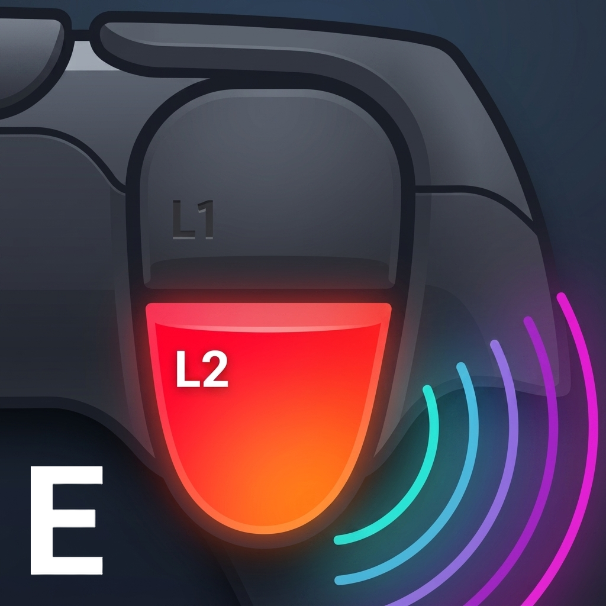

  <a href="../README.md">English</a> •
  <a href="ReadmeZH.md">简体中文</a> •
  <strong>日本語</strong>

  
  <h1>FH-DualSense-Enhanced</h1>
  
<strong>PC 版 Forza Horizon に DualSense のアダプティブトリガーとテレメトリ触覚を追加します。</strong>

FH-DualSense-Enhanced は Forza Horizon の Data Out テレメトリを読み取り、ブレーキ、アクセル、エンジン、路面、タイヤ、衝突のデータを DualSense のフィードバックへ変換します。

現在は Windows の Steam と Xbox App における Forza Horizon 4、Forza Horizon 5、Forza Horizon 6 の利用フローに対応し、概要ページでプラットフォームと作品を選択して記憶できます。

`Forza-Horizon-DualSense-Python 1.6.2` を基にし、`HorizonHaptics 1.3.0` を参考にした非公式の拡張版です。

## アップストリーム 1.6.2 からの拡張

- テレメトリ駆動の握把触覚に、エンジン、路面、サスペンション、水たまり、タイヤスリップ、ABS、動的レッドライン学習、方向付き衝突を統合します。
- 拡張アダプティブトリガーは、動的グリップと wheelspin、路面別周波数帯、ゾーン ABS、任意のテレメトリ効果を追加します。
- USB と Bluetooth は同じステレオ触覚ミックスを使用します。Bluetooth は HD 転送を追加し、転送が実際に失敗した場合のみ互換振動へフォールバックします。
- コミュニティを参考にした Default、内蔵 Original プリセット、永続保存、名前付きプロファイル、安全な初期化により設定管理を改善します。
- 多言語の高 DPI デスクトップ UI は、接続方式、バッテリー、充電状態をリアルタイム表示し、FH4/FH5/FH6 Steam/Xbox App ランチャー、内蔵 DualSense-to-XInput ブリッジ、復元可能な FH6 DualSense ボタンアイコンを提供します。
- スタンドアロン EXE は検証付きトランザクション更新を使用し、設定を保持して一致するショートカットを移行し、中断した置換から復旧またはロールバックできます。

## ダウンロード

### Windows の推奨方法

1. [最新 Release](https://github.com/piereacy/FH-DualSense-Enhanced/releases/latest) を開きます。
2. `FH-DualSense-Enhanced-R<n>.exe` をダウンロードします。
3. EXE を実行します。Python、BAT、ZUV、uv は不要です。

その他の起動方法：

- Windows ランチャー：`win_start.bat` をダウンロードします。回線が不安定な場合は、先に `FH-DualSense-Enhanced.zuv.py` を同じ場所へ置いてください。
- Linux：`linux_start.sh` をダウンロードします。コントローラーの権限エラーが出る場合は、同梱の [`70-dualsense.rules`](../packaging/linux/70-dualsense.rules) を手動でインストールしてください。

## 必須のゲーム設定

### 1. ゲームのプラットフォームを選択する

- **Steam：****ゲームのプロパティ -> コントローラー**で Steam Input を有効のままにし、Steam の DualSense 振動サポートも有効にします。
- **Xbox App：**FH-DualSense-Enhanced で Xbox App を選択します。内蔵 XInput ブリッジが DS4Windows または Steam Input の代わりになり、初回は Windows UAC 経由で同梱 ViGEmBus ドライバーのインストールを求める場合があります。インストールにインターネット接続は不要です。

### 2. Forza Data Out を有効にする

ゲームの**設定 -> HUD とゲームプレイ**を開き、次の値を設定します。

| 設定 | 値 |
| --- | --- |
| Data Out | ON |
| Data Out IP Address | `127.0.0.1` |
| Data Out IP Port | `5300` |

ループバックで受信できない場合は、ゲームとアプリの両方で `::1` を試してください。

### 3. 次の順序で起動する

1. DualSense コントローラーを接続します。
2. FH-DualSense-Enhanced を起動し、コントローラーと UDP 待受が準備できたことを確認します。
3. ゲームを起動します。

> [!IMPORTANT]
> Steam モードでは Steam Input は有効のままにします。すべてのモードで Forza のゲーム設定にある「振動」は必ず無効にしてください。ゲーム本来の振動が握把触覚と競合して覆い隠すため、ゲーム内振動が有効な状態では握把フィードバックが正常に動作しません。

## USB と Bluetooth

どちらも同じテレメトリ判定を使用し、アダプティブトリガー、路面、エンジン、レッドライン、方向付き衝突に対応します。

| 接続方式 | 説明 |
| --- | --- |
| USB | 握把触覚は DualSense オーディオ、アダプティブトリガーは HID を使用します。 |
| Bluetooth | 触覚とトリガーを HID で送信します。HD haptics が利用できない場合は自動的にフォールバックし、トリガー機能は維持されます。 |

## トラブルシューティング

| 症状 | 確認する内容 |
| --- | --- |
| `No UDP packets yet` | Data Out、待受アドレス、UDP ポート `5300`、Windows ファイアウォールを確認します。 |
| `WinError 10048` | 別のアプリが UDP ポート `5300` を使用しています。重複した待受プログラムを終了します。 |
| DualSense が見つからない | コントローラーを再接続し、Steam、HidHide、またはコントローラーを占有するアプリを確認します。 |
| USB 触覚または `PaErrorCode -9999` | DualSense オーディオを確認し、使用中のアプリを閉じて USB を再接続します。トリガーは引き続き使用できます。 |
| Bluetooth 触覚のフォールバック | コントローラーを再接続して HD haptics を再試行します。フォールバック中もトリガーは使用できます。 |
| Xbox App で入力できない | アプリで Xbox App を選び、必要なら ViGEmBus の設定を完了し、同じコントローラーを Steam Input や DS4Windows に同時接続しないでください。 |

## FH6 ユーティリティ

専用の **FH6 ユーティリティ**ページでは、Steam または Xbox App のインストール先に対して中国語テキスト + 英語音声のファイル交換と、復元可能な DualSense ボタンアイコン MOD を利用できます。Steam と Xbox App のインストール先は自動検出され、手動選択もフォールバックとして利用できます。言語状態は現在のゲーム言語、実際の表示言語、音声言語を個別に表示し、確認できない値は推測しません。ゲーム更新で元のファイルに戻った場合は再度適用してください。アイコン MOD 作者 [@hotline1337](https://github.com/hotline1337)：[Nexus Mods MOD ページ](https://www.nexusmods.com/forzahorizon6/mods/2)。

## クレジットとライセンス

原作者 Hamza Yeşilmen（HamzaYslmn）：
[Forza-Horizon-DualSense-Python](https://github.com/HamzaYslmn/Forza-Horizon-DualSense-Python)

握把触覚は [HorizonHaptics](https://github.com/haritha99ch/HorizonHaptics) を、Bluetooth プロトコルは [vDS](https://github.com/hurryman2212/vds) を参考にしています。関連する表記は [THIRD_PARTY_NOTICES.md](THIRD_PARTY_NOTICES.md) に含まれています。

本プロジェクトは、個人かつ非商用利用に限定した独自のソース公開ライセンスを採用しています。コピー、変更、再配布を行う前に [LICENSE](../LICENSE) を確認してください。
