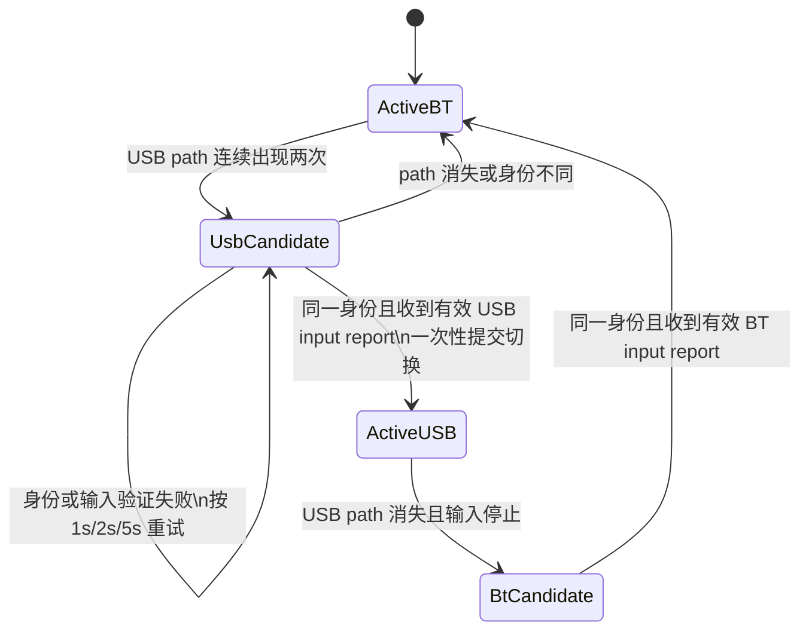

# Enhanced R7 传输切换、触觉续航与反馈页面拆分设计

日期：2026-07-20  
状态：用户已确认；主体实现已完成，Bluetooth -> USB 握把触觉重置修正待实现和实机验证

## 1. 背景与目标

本设计合并处理五个已经通过日志、截图或当前代码确认的问题：

1. `src/modules/dualsense/main.py` 在 Bluetooth 工作期间发现 USB 接口后，会在目标 USB 尚未证明可用前关闭当前 Bluetooth handle。失败后再恢复 Bluetooth，因而会出现反复切换、R2 扳机键脉冲和状态栏长期停留在 Bluetooth 的现象。
2. USB 接口第一次读取 feature report `0x09` 失败后，当前 `_identity_attempted` 会把该 path 视为本次插入周期内已经处理，不再重试；这会让一个瞬时错误永久阻止本次 BT -> USB handover。
3. GUI/TUI 的 USB audio 预热生命周期与遥测线程中的 `HapticManager` 会操作同一个 `UsbAudioHaptics`。R7 新增的 PortAudio hot-plug refresh 只锁住 `_terminate()` / `_initialize()`，没有锁住完整的“检查、刷新、建流”事务；两个调用者可能先后刷新全局 PortAudio，终止刚创建的有效 stream，之后 `_running` 仍可能让上层误以为握把触觉正常。
4. GUI 最大化时，`src/modules/gui/controls_tab.py` 会对所有卡片执行 `grid_forget()` 后重新挂载；`src/modules/gui/system_tab.py` 每 250 ms 无条件卸载并重挂更新按钮。这会造成页面切换或窗口放大卡顿以及功能控件像“重新加载”一样闪动。
5. 现有“驾驶反馈”和“握把触觉”页面按“开关/参数”而非按输出设备划分，导致握把开关出现在扳机页面、扳机参数出现在握把页面。用户已选择完整拆分方案 A。

本次目标是：保持既有驾驶反馈算法、优先级、默认参数和 USB/Bluetooth 触觉内容不变，只修复传输与音频生命周期，并让前端按“扳机键输出”和“握把输出”形成两个完整页面。

## 2. 选定方案

### 2.1 非破坏性 handover

把“枚举到另一种传输”和“已经切换到另一种传输”分成两个阶段：



候选验证期间继续保留当前 handle、当前 `ControllerSnapshot` 和当前触觉路由，不发布虚假的 `SWITCHING -> transport=None` 状态，也不向候选 handle 写扳机或振动输出。

候选 path 的重试状态至少保存：失败次数、下次允许尝试时间和最后一次出现时间。失败后的等待依次为 `1 s`、`2 s`、`5 s`，之后保持 `5 s`；path 消失或验证成功时清除该状态。feature report 身份读取失败不得再写入永久性的“一次尝试完成”集合。

候选必须同时满足：

- topology 已连续观察到两次；
- feature report 或枚举 serial 解析出的身份与当前控制器身份相同；
- 候选 handle 成功打开；
- 在限定时间内收到并通过 `parse_input_report()` 验证的完整 input report。

验证成功后直接接管已经验证过的 handle，避免关闭后重新打开造成 TOCTOU。提交动作仍只在现有 DualSense I/O thread 上串行执行：先让旧传输静音，再交换 handle/path/layout，使用候选的首个有效报告发布新的 `CONNECTED` snapshot，关闭旧 handle，最后只重放一次当前已锁存的 trigger/rumble/visual 状态。启动测试脉冲在 handover 中继续禁用。

若候选验证失败，关闭的只能是候选 handle；当前传输不得断开。只有当前传输本身已经失效时，现有 watchdog 才进入普通断线重连。

### 2.2 状态展示与触觉路由

顶部状态框和总览只读取经过有效 input report 确认的 `ControllerSnapshot`。枚举结果、充电线存在、候选 transport 或已打开但尚未产生有效报告的 handle 都不能直接把状态改成 USB/BT。

电量、充电状态和 transport 必须来自同一份已确认 snapshot，避免拼出“候选 USB 的充电状态 + 仍在工作的 BT transport”这一类跨来源状态。候选验证成功后，用户界面在下一次正常轮询中显示 USB；验证期间继续显示实际工作的 BT。

`HapticManager` 只在 snapshot transport 真正提交变化时切换 Bluetooth HD / USB audio 路由。失败的候选探测不会停止 Bluetooth HD worker，也不会清空持续路面反馈。

### 2.3 USB audio 并发与失活恢复

`UsbAudioHaptics` 增加实例级生命周期锁，完整覆盖以下原子操作：

- 判断当前 stream 是否健康；
- 必要时关闭失活 stream；
- Windows PortAudio device-cache refresh；
- endpoint 枚举和新 stream 创建、启动；
- `stop()` 与 renderer reset。

全局 `_portaudio_refresh_lock` 继续用于保护 sounddevice 的进程级 `_terminate()` / `_initialize()`，但只能在实例生命周期锁内、确认该实例没有健康 stream 时进入。第二个并发 `start()` 在取得实例锁后必须重新检查健康状态；若第一个调用已经成功，第二个调用直接复用，禁止再次 terminate PortAudio。

`running` 不再只相信 `_running` 布尔值。若底层 stream 提供 `active` / `stopped` 状态并已失活，下一次受限频率的同步或路由应清理旧对象并重新建流。状态查询异常按“不健康”处理并写限频日志，不能继续永久吞掉握把帧。

GUI/TUI 的 `UsbAudioLifecycle` 与遥测线程仍可共用一个 `UsbAudioHaptics`，但所有 start/stop 都通过上述原子边界。这样保留“没有新 UDP 帧时也能检查 USB endpoint”的既有能力，同时消除 R7 refresh 引入的并发终止风险。

允许 BT -> USB 提交时出现不超过约 `1 s` 的短暂无握把输出；不允许切换后长期只剩扳机输出。USB -> BT 同样必须自动恢复 Bluetooth HD body haptics。

### 2.4 Bluetooth -> USB 的一次性音频触觉重置

真实硬件已确认以下边界：Bluetooth 冷启动和 USB 冷启动的握把触觉都正常；只有程序运行中的 Bluetooth -> USB handover 会出现“扳机仍工作、状态显示 USB、PortAudio callback 活跃，但握把完全无输出”。因此该问题不是 UDP、PCM renderer、USB endpoint 枚举或一般性的 USB 启动失败，而是 handover 后控制器内部触觉模式没有回到 USB audio haptics。

现有候选实现照搬 HorizonHaptics 的注释，把 `valid_flag0 0x20` 当成 `HAPTICS_SELECT`，并把 `valid_flag1 0x20` 当成 `HAPTICS_CONTROL_ENABLE`。该解释与 Linux `hid-playstation` 的 DualSense 输出协议以及完整 SetState 布局不一致：真正的 `HAPTICS_SELECT` 是 `valid_flag0 0x02`，并用于选择 compatible rumble；`valid_flag0 0x20` 属于 speaker volume control，`valid_flag1 0x20` 也不是 USB audio-haptics 接管位。生产实现必须删除这两个错误的 `0x20` 声明和输出。

BT -> USB handover 的 USB handle 已验证并提交后，由现有唯一 HID I/O thread 排队一次专用重置报告：

1. 保留当前 L2/R2 扳机键和 visual 状态。
2. `valid_flag0` 包含扳机所有权 `0x0C` 和 compatible-vibration release `0x01`。
3. 明确不设置 `HAPTICS_SELECT 0x02`，左右 compatible motor byte 均为零。
4. 该报告成功写入一次后清除 pending 状态；后续恢复普通 trigger/visual 报告，不在每帧重复 `0x01`。
5. `HapticManager` 继续负责选择 USB PCM 或 Bluetooth `0x36` backend，但不得直接另开 HID handle 或自行写协议报告。

这一序列的目的不是启用 compatible rumble，而是终止该模式并让控制器重新接受 USB 四声道 PCM 的握把通道。冷启动 USB 不改变现有报告序列；Bluetooth `0x36` 封包、CRC、采样率和握把混音保持不变。若专用报告写入失败，沿用现有 HID 断线处理，不得仅凭 PortAudio callback 活跃记录“握把触觉已经恢复”。

协议字段含义以 Sony 维护的 Linux `hid-playstation` 实现为主，并用公开的 DualSense HID 逆向记录交叉核对；HorizonHaptics 只保留为效果设计参考，不再把其两处 `0x20` 注释作为协议依据。

## 3. 前端布局与性能

### 3.1 最大化与页面切换

`FastScroll` 现有的可见页面门控继续保留。额外修复两个已确认热点：

- 扳机页面响应式布局使用约 `80 ms` 的 trailing debounce；隐藏页面不调度布局。
- 只有列数实际从一列变两列或从两列变一列时才更新卡片位置。
- 已挂载卡片使用 `grid_configure()` 或等价的就地更新，不先调用 `grid_forget()`；最大化可以发生一次重排，但控件不得消失后重新创建。
- `SystemTab._refresh_update_status()` 缓存展示 tuple。状态文字、进度、action 类型和 release URL 都没有变化时，不调用 `configure()`、`pack_forget()` 或 `pack()`。
- 导航继续使用一次性挂载加 `tkraise()`，不得恢复逐页销毁/重建。

本轮不重写 CustomTkinter，也不引入新的 UI 框架。若上述局部修复后最大化仍有少量 Tk 固有重排延迟，可以记录为后续优化，但不能再出现功能按钮整组闪烁。

### 3.2 顶栏状态框

顶栏 Profile 和 DualSense 状态框继续执行已确认的 `docs/superpowers/specs/2026-07-20-header-status-frame-rendering-design.md`：逻辑高度 `28`、圆角 `8`、间距使用 `4` 的倍数，并缓存 presentation 值。人工验证覆盖 Windows `100%`、`125%`、`150%`。

若 `125%` 或 `150%` 原始分辨率截图仍出现与现有截图相当的连续阶梯、底边断裂或缺口，只把圆角降为 `0`，改为方框；不再增加位图背景或复杂 Canvas 假圆角。

## 4. 扳机与握把页面完整拆分

现有两个导航位置继续复用，不增加第三个页面：

### 4.1 扳机反馈

“驾驶反馈”重命名为“扳机反馈”。该页包含所有作用于 L2/R2 扳机键的开关、普通参数和实验性参数：

- L2 brake：换挡冲击、ABS、静态防护墙、刹车阻力、手刹额外阻力；
- R2 throttle：换挡冲击、怠速震动、R2 扳机键红线震动、油门阻力；
- 轮胎抓地力扳机反馈；
- 踏板死区、L2/R2 基础力、ABS、红线、怠速和换挡参数；
- 实验性涡轮/G 力阻力、碰撞扳机冲击、空闲路面纹理、ABS 与抓地力高级调节。

现有英文 `Traction/grip feedback` 改为更明确的 `Tire grip trigger feedback`，中文使用“轮胎抓地力扳机反馈”。该功能根据轮胎状态选择 L2/R2 输出，虽然名称含有 grip，但它不属于物理握把振动。

### 4.2 握把触觉

“握把触觉”页只包含通过 USB audio 或 Bluetooth HD haptics 输出到左右握把的功能：

- Body haptics 总开关与总强度；
- engine、road、impact/suspension、slip/ABS 分量及 threshold；
- 握把换挡冲击开关和参数；
- 握把红线开关、左右握把选择和参数；
- 握把红线高级调节与碰撞触觉高级调节。

实验性内容在各自页面内继续放入默认折叠的“实验性功能”，并保留“不建议自行调节”的提示。不得为了页面拆分而改变任何开关默认值、Profile 字段或 `modules/forzahorizon/effects.py` / `modules/haptics/mixer.py` 的计算逻辑。

### 4.3 GUI/TUI 一致性

GUI 与 Console 前端使用同一份纯数据字段分组，渲染器各自负责 CustomTkinter/Textual 控件，不允许 TUI 再维护一份容易漂移的手写分类。`SystemTab` 继续使用系统设置分组，不被反馈页面拆分绑定。

总览快捷入口、导航标题、TUI tab 名称和 `src/lang/` 全部语言目录同步更新。非英语目录必须提供翻译或明确使用英文 fallback；不得出现同一字段同时属于扳机页和握把页。

“恢复出厂默认设置”仍是全局操作，可继续从总览和配置文件页面进入，不把它解释成某一种反馈的专属功能。

## 5. 错误处理与日志

- 身份读取、候选打开和首个 input report 超时分别记录可区分的限频日志；预期重试不打印 traceback。
- 只有真正提交 handover 时记录一次 `BT -> USB` 或 `USB -> BT`；候选失败日志必须明确“保留当前 transport”。
- PortAudio 并发复用、失活 stream 清理和重启应有 debug/info 日志，但每个遥测帧不得重复输出。
- 所有候选 handle、失败 stream 和旧 handle 都必须在异常路径关闭。
- GUI/TUI 只在主线程更新控件；后台 candidate probe 和 update snapshot 不直接触碰 Tk/Textual widget。

## 6. 测试与验收

### 6.1 自动测试

DualSense：

- feature `0x09` 首次失败、随后按 `1/2/5 s` 成功时能够继续 handover；
- 候选消失会清除 retry state，再插入可立即重新开始；
- 不同身份的 USB 不会抢占当前 BT；
- 候选 open 或 input validation 失败时，当前 handle、snapshot、trigger state 和 BT haptics 不变；
- 有效候选只提交一次，handover 不播放 startup pulse，当前输出只重放一次；
- USB -> BT fallback 也要求同一身份和有效 input report。
- Bluetooth -> USB 提交只排队一次 USB audio-haptics 重置报告；报告的 `valid_flag0` 必须包含 `0x0C | 0x01`、排除 `0x02` 和错误的 `0x20`，两个 compatible motor byte 为零。
- 重置报告必须先于恢复后的普通 USB trigger/visual 报告，且不会在后续遥测帧重复；Bluetooth 和 USB 冷启动报告保持既有行为。

USB audio：

- 两个线程同时 `start()` 只执行一次 PortAudio refresh 并只创建一个 stream；
- `start()` 与 `stop()` 不会交错破坏新 stream；
- `_running=True` 但 stream 已 inactive 时会限频重建；
- transport 候选失败不停止当前 haptics，已确认 transport 切换会正确停止旧 route 并启动新 route。

前端：

- GUI/TUI 使用同一字段分组；扳机与握把字段集合互斥且覆盖本次列出的全部字段；
- 实验性 trigger/grip 参数分别只出现在对应页面；
- 响应式布局在同一列数下不重复重排，列数变化时不调用卡片 `grid_forget()`；
- 更新状态 presentation 未变化时不重新 map/unmap 按钮；
- 顶栏状态框尺寸、缓存和 100%/125%/150% 整数像素契约继续通过。

完成定向测试后运行仓库既有完整门禁：

```powershell
uv run --project src --frozen pytest -q
uv run --project src --frozen ruff check src tests packaging .github
uv run --project src --frozen pyrefly check src
uv run --project src --frozen python -m compileall -q src/main.py src/modules src/lang tests packaging/windows/update_helper.py packaging/windows/shortcut_links.py packaging/windows/write_sha256.py packaging/windows/dpi_runtime_hook.py
uv lock --check --project src
git diff --check
```

### 6.2 真实硬件验收

1. 以 Bluetooth 启动程序并确认握把触觉连续工作。
2. 运行中插入 USB：允许约 `1 s` 短暂无输出；不得出现 R2 扳机键反复脉冲；状态只在 USB 有效报告到达后显示 USB；握把触觉自动恢复。
3. 拔出 USB：自动回到同一控制器的 Bluetooth，Bluetooth HD body haptics 自动恢复。
4. 连续运行至少 `20 min`，确认不会出现“扳机仍有反馈、握把完全消失”。
5. 在 Windows `100%`、`125%`、`150%` 下切换页面、最大化、还原并滚动长页面，确认无控件整组闪烁，顶栏无明显连续锯齿或底边缺口。

触觉体验记录必须同时注明：连接方式、Steam Input 状态和 Forza 游戏内振动状态。方向性、碰撞和握把反馈验收时应关闭游戏内振动，避免原生 rumble 掩盖项目输出。

当前实机结果必须保留为失败证据：错误 `0x20` 候选版能够完成 BT -> USB、启动 USB stream 并确认 callback 活跃，也消除了 R2 扳机键反复脉冲，但握把仍完全消失。只有新的单次 `0x01` 重置候选通过同一套冷启动基线和 BT -> USB 测试后，才允许把该问题标记为修复。

## 7. 明确不做

- 不修改扳机/握把算法、效果优先级、社区默认参数或 Profile 格式。
- 不接管菜单、CG、上车过场等 Forza 原生振动。
- 不新增 DSX 功能，不改变 XInput bridge，也不安装或配置 HidHide。
- 不改自动更新协议或 Release 产物命名。
- 不引入新的运行时依赖或二进制资产，预计 EXE 体积变化仅来自少量 Python 代码。
